# Introduzione all’argomento di oggi

-   Oggi completeremo la trattazione del lavoro e dell’energia
-   Introdurremo il concetto di “potenza”
-   Vedremo come si produce oggi energia per il consumo casalingo ed industriale

# Lavoro ed energia

-   L’energia è **la capacità di un corpo di compiere lavoro**, ossia di esercitare una forza $F$ in grado di spostare un corpo di $\Delta x$

-   Ad esempio, l’energia gravitazionale è ciò che rende possibile lo spostamento di un corpo che cade, compiendo lavoro nel farlo accelerare verso il basso

-   Oltre all’energia gravitazionale ci sono altri tipi, e tutti sono associati a qualche tipo di forza

-   Vediamo i più importanti

# Energia cinetica

::: side-by-side
::: content

-   È l’energia che ha un corpo per il fatto stesso di muoversi:
    \[
    E_c = \frac12 m v^2.
    \]

-   Se un corpo in movimento ne urta uno fermo, quest’ultimo si muove: è stato compiuto lavoro.

-   **Attenzione**: un corpo che si muove di moto rettilineo uniforme non compie lavoro!

:::

::: media
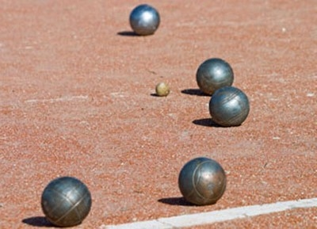
:::
:::

# Esempio

-   Una palla da bowling da 7 kg viene lanciata e si muove a 1 m/s
-   La sua energia cinetica iniziale è
    \[
    E_c^{(i)} = 0\,\text{J}
    \]
-   Quella finale è
    \[
    E_c^{(f)} = \frac12 \times 7\,\text{kg}\times (1\,\text{m/s})^2 = 3{,}5\,\text{J}
    \]
-   Di conseguenza, il giocatore ha compiuto un lavoro uguale a 3,5 J.

# Energia potenziale gravitazionale

::: side-by-side
::: content

-   La forza di gravità sposta i corpi verso il basso

-   Se un corpo sta in alto, ha quindi **energia potenziale gravitazionale**, che per un corpo ad un’altezza $h$ è
    \[
    E_g = m g h
    \]

:::

::: media
{height=400px}
:::
:::

# Esempio

-   Un corpo di 1 kg (ad esempio una bottiglia di latte) cade da un’altezza di 10 m. La sua energia cinetica iniziale è zero, e quella potenziale è
    \[
    E_g^{(i)} = 1\,\text{kg}\times 10\,\mathrm{m/s^2}\times 10\,\text{m} = 100\,\text{J}
    \]
-   Quando arriva a terra, tutta l’energia potenziale è diventata cinetica:
    \[
    E_c^{(f)} = E_g^{(i)} = 100\,\text{J}
    \]
-   Questo avviene perché ha acquisito velocità:
    \[
    100\,\text{J} = \frac12 m v^2 \quad \Rightarrow \quad v = 14\,\text{m/s}.
    \]

---

<iframe src="iframes/falling-ball.html" width="100%" height="740" style="border:1px solid #ccc; border-radius: 8px;"></iframe>

# Energia elastica {#energia-elastica}

::: side-by-side
::: content

-   Una molla compressa o allungata di $\Delta x$ ha la capacità di tornare alla sua posizione originaria:
    \[
    E_e = \frac12 k (\Delta x)^2,
    \]
    dove $k$ è una costante che dice quanto è “dura” una molla

-   La molla ha quindi la capacità di compiere lavoro: basta immaginare di attaccare alla sua estremità un corpo

:::

::: media
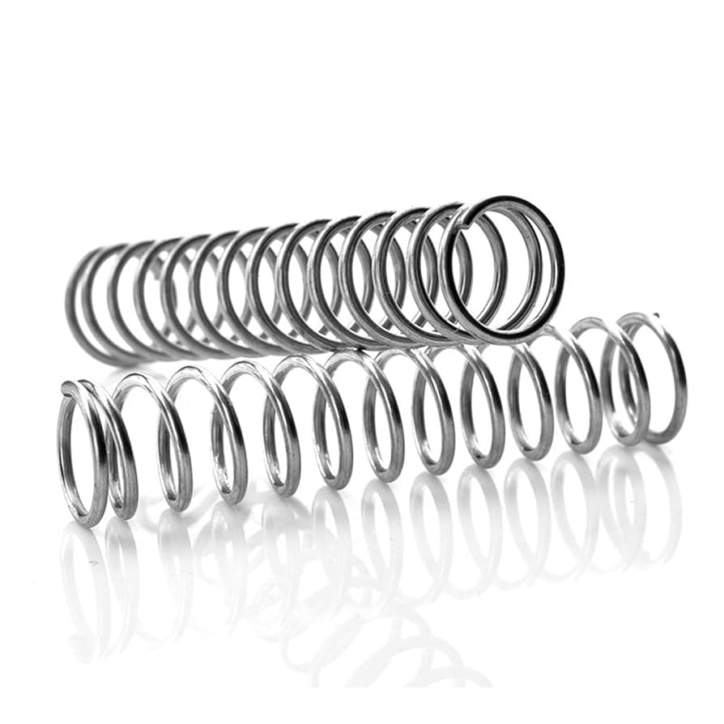{width=400px}
:::
:::

# Esempio

-   Una molla con $k = 10\,\mathrm{N/m}$ viene compressa di 1 cm.
-   Nel momento in cui viene rilasciata, l’energia cinetica è nulla, e quella elastica è
    \[
    E_e^{(i)} = \frac12\times 10\,\mathrm{N/m}\times (0.01\,\text{m})^2 = 0{,}000\,5\,\text{J} = 0{,}5\,\text{mJ}.
    \]
-   L’energia cinetica della sua estremità, quando torna alla posizione di riposo, è
    \[
    E_c^{(f)} = E_e^{(i)} = 0{,}5\,\text{mJ}.
    \]
-   Avendo energia cinetica, ha velocità non nulla e quindi inerzia: anziché fermarsi alla posizione di riposo, prosegue dando moto ad un fenomeno oscillatorio

# Energia chimica

::: side-by-side

::: content

-   Le molecole che formano i corpi sono tenute insieme da legami chimici, dovuti a forze elettromagnetiche

-   Queste forze agiscono più o meno come molle: impediscono che le molecole si allontanino o si avvicinino troppo

-   In una reazione chimica, i legami (le “molle”) si rompono o se ne formano di nuovi. Questo cambiamento porta a un rilascio di energia, oppure a un suo assorbimento

:::

::: media

:::
:::

# Energia termica (calore)

::: side-by-side
::: content

-   Le molecole dei corpi vibrano continuamente, e la vibrazione è maggiore nei corpi caldi (nei liquidi e nei gas, oltre alla vibrazione sono presenti anche moti rotatori e spostamenti)

-   Le vibrazioni sono governate dalle stesse forze molecolari ed atomiche che abbiamo nominato per l’energia chimica

-   Ad un corpo è associata quindi una certa **energia termica**, che è una forma di energia elastica/cinetica “disordinata”

:::

::: media
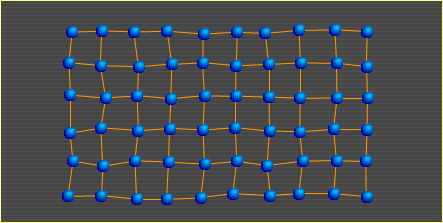
:::
:::

# Energia elettrica

::: side-by-side

::: content

-   Le cariche elettriche si attraggono e si respingono tra loro

-   Il movimento delle cariche elettriche è ciò che trasferisce energia (la “corrente elettrica” non è altro che il moto di cariche elettriche)

-   È una forma di energia molto conveniente, perché è estremamente semplice convertirla in altre forme di energia e trasportarla (almeno su distanze non esagerate!)

:::

::: media
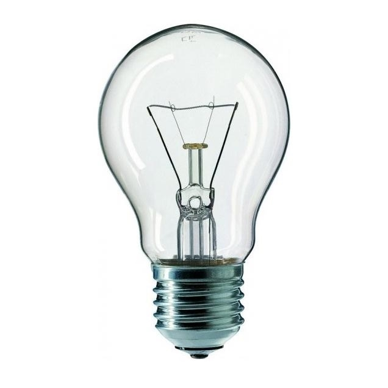
:::
:::

# Energia sonora

::: side-by-side

::: content

-   È l’energia che ci interessa di più!

-   In un altoparlante, l’energia elettrica fa vibrare una membrana che fa vibrare l’aria attorno ad essa: questa vibrazione produce un “effetto domino” che fa propagare il suono nell’aria anche a grandi distanze

-   Si tratta di energia cinetica: molecole d’aria che si muovono, più o meno come nel caso del calore. Però in questo caso il moto è **ordinato**: sono onde di pressione, che vedremo meglio in seguito
:::

::: media

:::
:::

# Esempi della vita reale

# La lavatrice

::: side-by-side

::: content

-   La lavatrice consuma energia elettrica

-   Converte l’energia elettrica in:

    Energia termica
    :   Riscalda l’acqua

    Energia cinetica
    :   Fa girare il cestello

    Energia sonora
    :   È il suono che fa quando il programma è terminato

:::

::: media

{height=400px}

:::
:::

# Piatto che si rompe

::: side-by-side

::: content

-   Il piatto nella credenza ha energia potenziale gravitazionale $E_g$
-   Durante la caduta converte l’energia potenziale in energia cinetica $E_c$
-   Al momento dell’urto, parte dell’energia diventa termica, parte sonora, e parte resta cinetica (nei frammenti)

:::

::: media

:::
:::

# Colpo di tennis

::: side-by-side

::: content

-   Una pallina da tennis raggiunge il giocatore con una certa velocità: ha quindi energia cinetica

-   Il moto della racchetta trasferisce l’energia cinetica del braccio alla pallina

-   Parte dell’energia viene usata per creare il rumore e per la deformazione delle corde e della pallina

:::

::: media

:::
:::

# Frenata di un’auto

::: side-by-side

::: content

-   L’automobile ha una certa energia cinetica
-   Il piede muove il pedale (energia cinetica), che stringe le ganasce dei freni
-   Le ganasce producono attrito, ossia calore che scalda i freni e l’aria, e rumore (energia sonora)
-   Se i freni sono rigenerativi, una dinamo converte parte dell’energia cinetica dell’automobile in elettricità, che viene convertita dalla batteria in energia chimica
:::

::: media
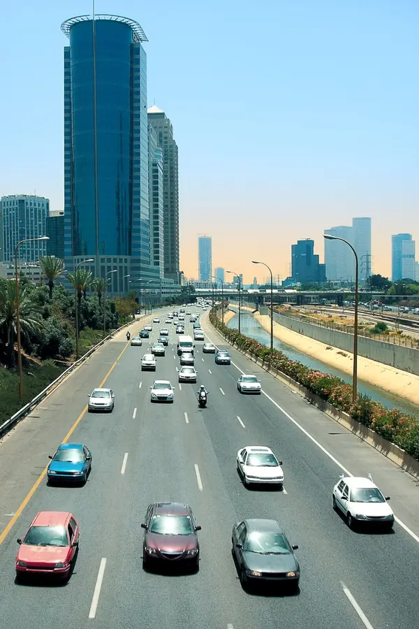{height=450px}
:::
:::

# Diga idroelettrica

::: side-by-side

::: content

-   Come nel caso dei piatti, l’acqua converte energia potenziale gravitazionale $E_g$ in energia cinetica
-   Questa si trasmette ad una turbina, facendola ruotare
-   Una dinamo converte l’energia cinetica (rotatoria) della turbina in energia elettrica
:::

::: media
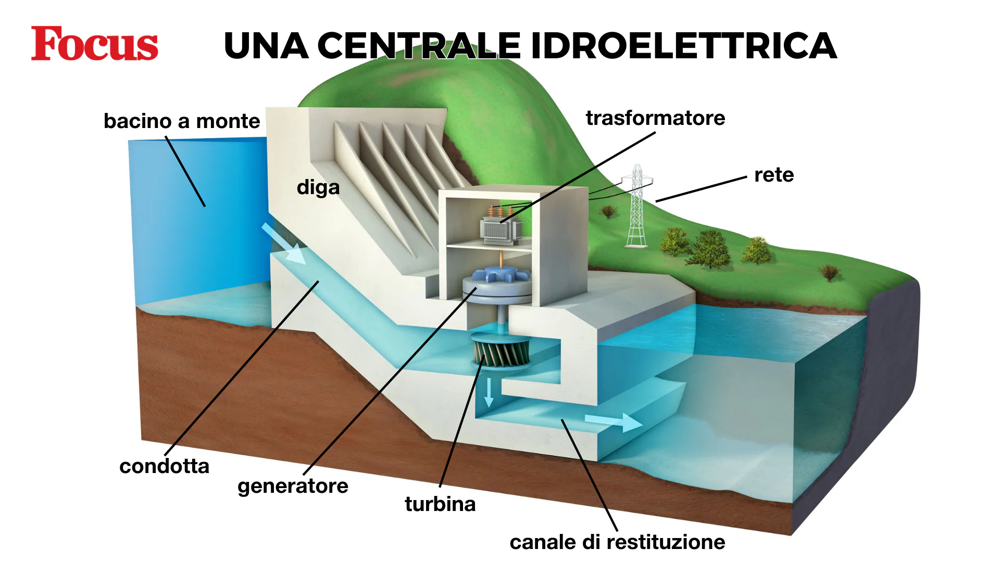
:::
:::

# Analogia col denaro

::: side-by-side

::: content

-   Dagli esempi fatti, si capisce che l’energia può essere paragonata a un tipo di denaro che non si può creare né distruggere, e non si svaluta mai

-   Come il denaro può essere convertito (contanti, somma in banca, lingotti d’oro), così anche l’energia si può convertire

-   Il “bilancio” dell’energia **è sempre perfetto**: se scompaiono $x$ Joule di energia da una parte, devono comparirne $x$ da un’altra.

:::

::: media
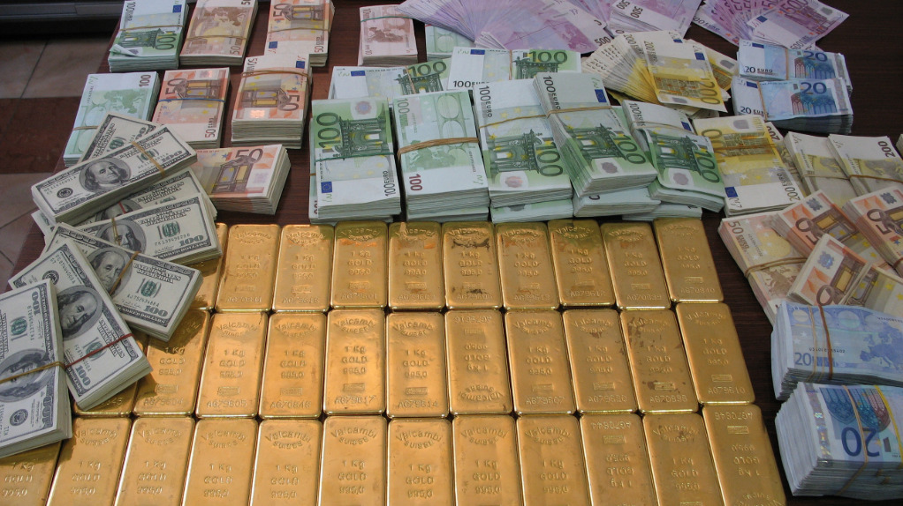
:::
:::

# Energia e potenza

# Il concetto di “potenza”

-   Abbiamo visto che l’energia è fondamentale per tutti i processi fisici e biologici

-   È però anche importante la **velocità** con cui l’energia viene convertita

-   La **potenza** $P$ è il rapporto tra una quantità di energia $E$ e il tempo necessario per “produrla” o “consumarla”:

    \[
    P = \frac{E}{\Delta t}
    \]

# Unità di misura

::: side-by-side

::: content

-   La potenza è una energia sul tempo, quindi la sua unità naturale è il Joule sul secondo. Questo è il Watt, che si abbrevia con **W**:

    \[
    1\,\mathrm{W} = \frac{1\,\mathrm{J}}{1\,\mathrm{s}}.
    \]

-   Il Watt è un’unità di misura molto comune!

:::

::: media

:::
:::

---

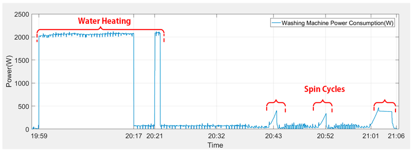{height=640px}

# Da potenza a energia

-   Conoscendo l’andamento della potenza consumata, si può stimare il consumo di energia

-   Ad esempio, nel grafico precedente la lavatrice ha consumato:

    -  circa 2000 W per una ventina di minuti (riscaldamento, che rappresenta il grosso del consumo)
    -  circa 400 W negli ultimi 5 minuti (centrifuga)
    -  circa 100 W nei restanti ~40 minuti

-   Calcoliamo quanta energia è stata consumata dalla lavatrice

---

-   Se la potenza è il rapporto tra energia e tempo, allora l’energia è la potenza per il tempo:
    \[
    \begin{split}
        2.000\,\text{W}\times 1.200\,\text{s} &= 2.400.000\,\text{J} = 2.400\,\text{kJ}\\
        400\,\text{W}\times 300\,\text{s} &= 120.000\,\text{J} = 150\,\text{kJ}\\
        100\,\text{W}\times 2.400\,\text{s} &= 240.000\,\text{J} = 270\,\text{kJ}
    \end{split}
    \]

-   In totale, la lavatrice ha quindi consumato
    \[
    2.400\,\text{kJ} + 120\,\text{kJ} + 240\,\text{kJ} = 2.760\,\text{kJ} \approx 2{,}8\,\text{MJ},
    \]
    che è circa 0,8 kWh (ricordate che 1 kWh = 3,6 MJ = 3.600 kJ).

-   Siamo confidenti del risultato?

---

{height=640px}

# Rifacciamo i conti!

-   Guardando attentamente il grafico, è chiaro che abbiamo usato dati approssimativi, e quindi il risultato **esatto** sarà un po’ diverso dal nostro. Ma quanto?

-   Cerchiamo di stimare non solo i valori della potenza (asse y) e del tempo (asse x), ma anche degli errori approssimativi:

    -  2050±50 W per circa 18±1 minuti (riscaldamento)
    -  450±25 W negli ultimi 5±1 minuti (centrifuga)
    -  75±25 W nei restanti minuti (40±2: l’errore è più grande perché ne sono meno sicuro)

-   Rifacciamo il calcolo usando la **propagazione degli errori**!

# Da potenza a energia

\[
\begin{split}
&(2050\pm50)\,\text{W}\times (1080\pm60)\,\text{s} + \\
+&(450\pm25)\,\text{W} \times (300\pm60)\,\text{s} + \\
+&(75\pm25)\,\text{W} \times (2400\pm120)\,\text{s}
\end{split}
\]

# Propagazione errori

-   Il conto consiste nella somma di tre termini, e nelle lezioni di Misure Elettriche ed Elettroniche vedrete che “nella somma gli errori **assoluti** si sommano in quadratura”

-   Però ogni termine della somma è il risultato di un prodotto, e “nel prodotto gli errori **relativi** si sommano in quadratura”

-   Dobbiamo quindi prima affrontare i tre prodotti

---

Il calcolo

\[
\textcolor{#269342}{(2050\pm50)\,\text{W}}
\times
\textcolor{#682693}{(1080\pm60)\,\text{s}}
=
\textcolor{#932642}{(2.214.000\pm?)\,\text{J}} 
=
\textcolor{#932642}{(2{,}214\pm?)\,\text{MJ}}
\]

coinvolge due quantità, il cui errore relativo è

\[
\textcolor{#269342}{\frac{50\,\text{W}}{2050\,\text{W}} = 0{,}024\ (2{,}4\,\%)},
\quad
\textcolor{#682693}{\frac{60\,\text{s}}{1080\,\text{s}} = 0{,}056\ (5{,}6\,\%)}
\]

L’errore **relativo** è quindi la somma in quadratura:

\[
\sqrt{\textcolor{#269342}{0{,}024}^2 + \textcolor{#682693}{0{,}050}^2} = \textcolor{#932642}{0{,}061\ (6{,}1\,\%)}.
\]

Il 6,1% di 2,214 MJ è 0,13 MJ, che è l’errore che cerchiamo.

---

-   Applicando i medesimi calcoli agli altri termini, scopriamo che

    \[
    \begin{split}
    (450\pm25)\,\text{W} \times (300\pm60)\,\text{s} &= (135\pm28)\,\text{kJ}\\
    (75\pm25)\,\text{W} \times (2640\pm60)\,\text{s} &= (180\pm61)\,\text{kJ}
    \end{split}
    \]

-   La somma è
    \[
    \bigl[(2.210\pm130) + (135\pm28) + (181\pm60)\bigr]\,\text{kJ} = (2.520\pm150)\,\text{kJ},
    \]
    dove l’errore è dato dalla somma in quadratura:
    \[
    \sqrt{(130\,\text{kJ})^2 + (28\,\text{kJ})^2 + (61\,\text{kJ})^2} = 150\,\text{kJ}.
    \]

---

-   Abbiamo ottenuto come risultato 2,52 ± 0,15 MJ.

-   Col nostro conto originario, molto più semplice, avevamo ottenuto 2,8 MJ.

-   I due valori sono **compatibili** solo se ammettiamo che il nostro vecchio valore fosse molto incerto!

# Il Kilowattora

::: side-by-side

::: content
-   Possiamo ora comprendere la definizione del **Kilowattora** (kWh)

-   Esso è l’energia che si estrae da una potenza di 1 kW (un chilowatt) in un’ora di tempo:

    \[
    1\,\mathrm{kWh} = 1\,\mathrm{kW} \times 3.600\,\mathrm{s} = 3{,}6\,\mathrm{MJ}
    \]

-   I fornitori di energia come ENI, Enel, Sorgenia, etc., riportano l’energia consumata in bolletta usando i kWh.
:::

::: media
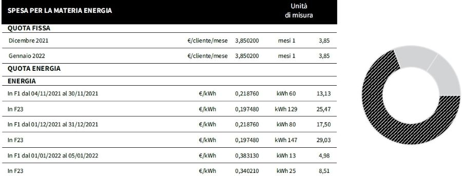
:::
:::

# Usare i Kilowattora

-   Sebbene i kWh non siano un’unità del SI, sono molto utili!

-   Se sapete ad esempio che il vostro frigorifero consuma circa 100 W (complimenti! è [molto efficiente](https://ounapuu.ee/posts/2025/10/14/fridge-power-consumption/#fnref:1)), allora in un giorno esso consumerà

    \[
    100\,\text{W} \times 24\,\text{h} = 2.400\,\text{Wh} = 2{,}4\,\text{kWh},
    \]

    che corrisponde a una spesa giornaliera di circa 50 centesimi: in un mese il frigo vi costa 15€ in bolletta.

-   Per monitorare il consumo degli elettrodomestici, esistono prese intelligenti che misurano la potenza consumata dall’apparecchio a cui sono collegate (cercate su Internet “smart plug” o “presa smart”)

# Esempi di consumo

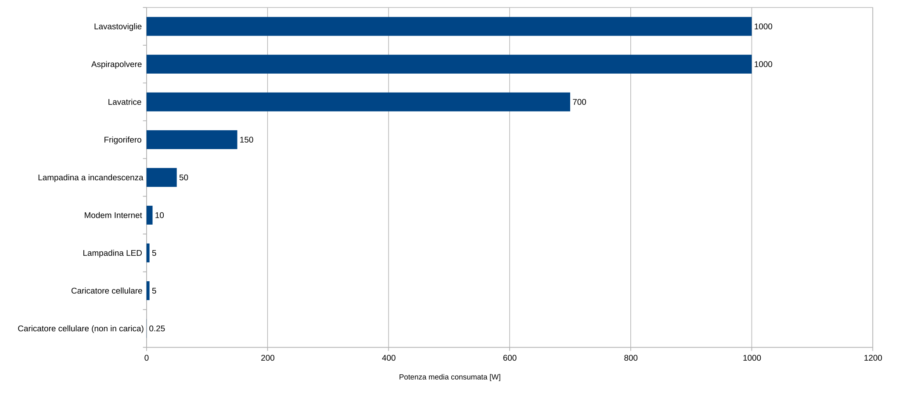

# “Produzione” di energia

# Energia nelle case

-   L’energia nelle case arriva principalmente sotto forma di:

    -   Elettricità

    -   Gas

    -   Biomassa (legna, pellet…)

-   In ambito domestico, il gas e la biomassa vengono tipicamente usate solo per produrre calore (fornelli, termosifoni, stufe). Non è però così a livello di produzione nazionale

-   L’energia elettrica è estremamente versatile perché è facile trasportarla (su distanze non eccessive) e convertirla in altre forme

# L’energia in Italia

-   Nel 2024, in Italia si sono consumati 312 TWh di energia

-   Convertiti in Joule, si tratta di un **miliardo di miliardi di Joule**, ossia **un milione di TJ**

-   Come produciamo questa energia?

# Fonti fossili

-   Poco più del 40% dell’energia prodotta in Italia viene da fonti fossili: principalmente gas, ma anche carbone:

    -   Il gas viene bruciato (producendo CO₂ 🙁) per scaldare acqua
    -   L’acqua evapora, e il vapore fa girare turbine
    -   Alle turbine è collegata una dinamo, che produce energia elettrica

-   Esistono ancora 4 centrali a carbone in Italia: 2 sono sul punto di essere chiuse, mentre per le altre 2 (entrambe in Sardegna) è stata [posticipata la chiusura al 2029](https://www.qualenergia.it/articoli/pichetto-carbone-centrali-resteranno-stand-by/)

# Fonti rinnovabili

-   Un altro 40% proviene da fonti rinnovabili:

    -   Centrali idroelettriche
    -   Energia solare
    -   Pale eoliche
    -   Biomasse (le uniche che producono CO₂)

-   Le centrali idroelettriche hanno un rilevante impatto ambientale quando vengono costruite (anche sul medio termine, [a livello di gas serra](https://www.hydropower.org/blog/new-study-sheds-light-on-reservoir-emissions-over-a-long-time-period))

-   La produzione di pannelli fotovoltaici e pale eoliche è [molto inquinante](https://www.bbc.com/future/article/20150402-the-worst-place-on-earth), ma avviene di solito all’estero

# Acquisti dall’estero

-   Oltre al 40% di fonti fossili e al 40% di rinnovabili, il restante 20% è energia elettrica acquistata dall’estero

-   Dal momento che l’energia elettrica non può essere trasportata per lunghi tratti, possiamo acquistarla solo da Francia, Svizzera, Slovenia ed Austria

-   Oltre ad acquistare elettricità dall’estero, importiamo però anche moltissimo gas: il 95% di quanto consumiamo! Questo è uno dei motivi per cui il costo dell’energia elettrica in Italia è [uno dei più cari in Europa](https://tg24.sky.it/economia/2025/05/30/energia-prezzo-elettricita-italia-europa#03)

# Requisiti

-   Qualsiasi sistema di distribuzione elettrica deve garantire un flusso di energia costante: non è possibile produrre meno di quanto serve (ovvio!), ma neanche di più (meno ovvio!)

-   Questo è problematico soprattutto per l’energia solare ed eolica! A queste fonti variabili deve quindi sempre essere associata una o più centrali di “emergenza” (gas, carbone, nucleare)

-   Una possibile soluzione sarebbe l'uso di **sistemi di accumulo** (ad es., batterie), che immagazzinino l'energia quando è abbondante e la distribuiscano nei periodi di bisogno.

---

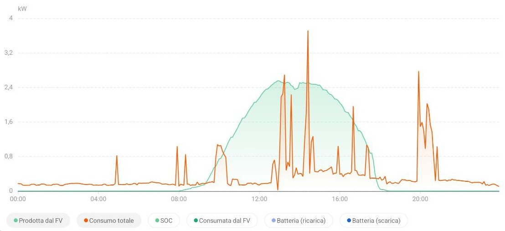

Produzione (da pannelli fotovoltaici) e consumo di energia in una giornata di sole (venerdì 24 ottobre 2025). I pannelli hanno prodotto 14,61 kWh; 6,74 ne sono stati consumati, e 1,88 sono stati immessi dalla rete per un consumo totale di 8,62 kWh.

---

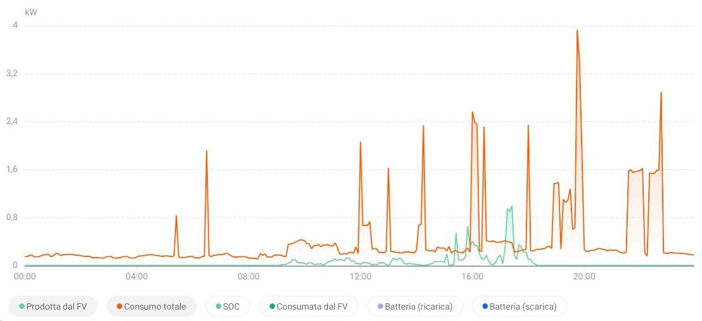

Produzione (da pannelli fotovoltaici) e consumo di energia in una giornata di pioggia (giovedì 24 ottobre 2025). I pannelli hanno prodotto 0,68 kWh; sono stati quasi tutti auto-consumati, e ne sono stati importati 9,69 dalla rete.

# Tipi di accumulatori

-   Batterie dei cellulari e dei dispositivi elettronici: 0,01 kWh

-   Batterie per la casa: 10–80 kWh

-   Batterie per le automobili elettriche: 20–120 kWh

-   Grandi batterie: fino a 2.000 kWh ([Moss Landing Power Plant](https://en.wikipedia.org/wiki/Moss_Landing_Power_Plant), California)

Per avere un sistema di accumulo come quello Californiano ma capace di garantire all’Italia una potenza di 50 GW per 4 ore ci vorrebbero 2.500 G€, che è più del doppio del PIL nazionale (la manovra finanziaria 2025 è di 18 G€).

# Conclusioni

# Cosa sapere per l’esame

-   Cos’è l’energia
-   Tipi di energia
-   Tutti gli esempi sull’energia visti in classe (lavatrice, piatto che si rompe…)
-   Potenza, W e kWh

---
title: Fisica -- Lezione 4
subtitle: Energia (continua)
author: Davide Bianchi ([davide.bianchi1@unimi.it](mailto:davide.bianchi1@unimi.it))
date: Mercoledì 2 Settembre 2026
institute: (slides mutate dal corso di Maurizio Tomasi)
...
