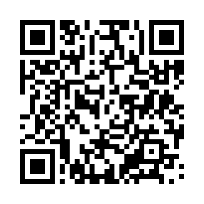
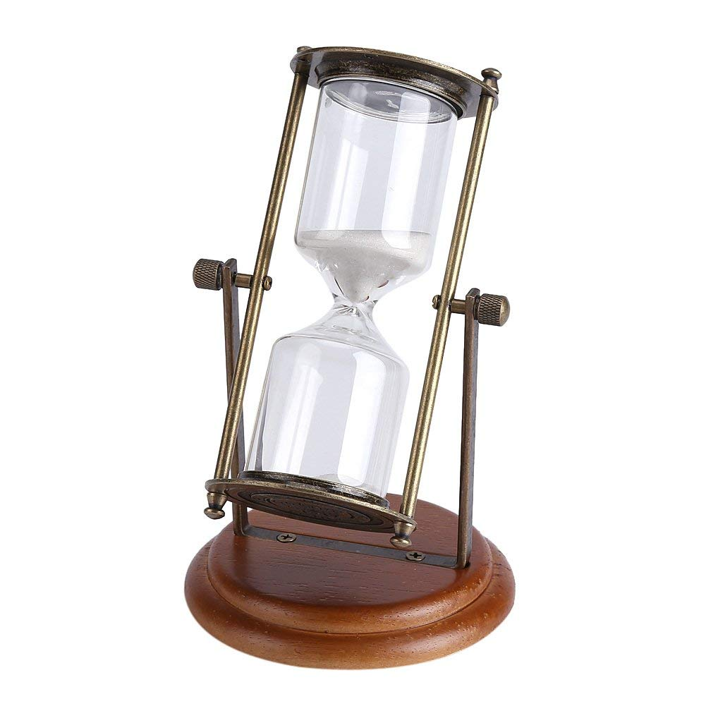
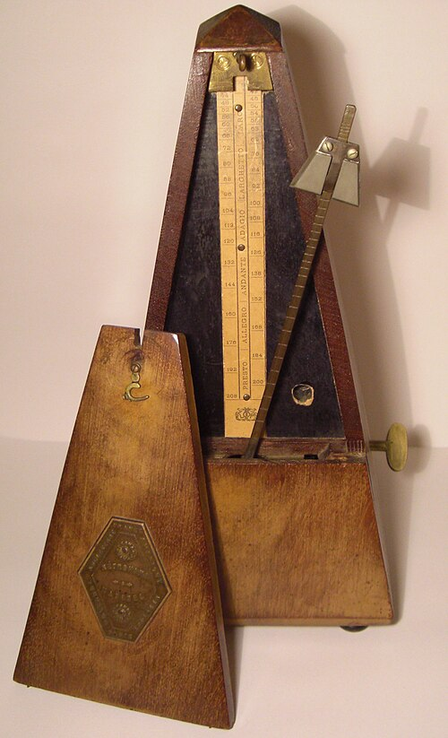
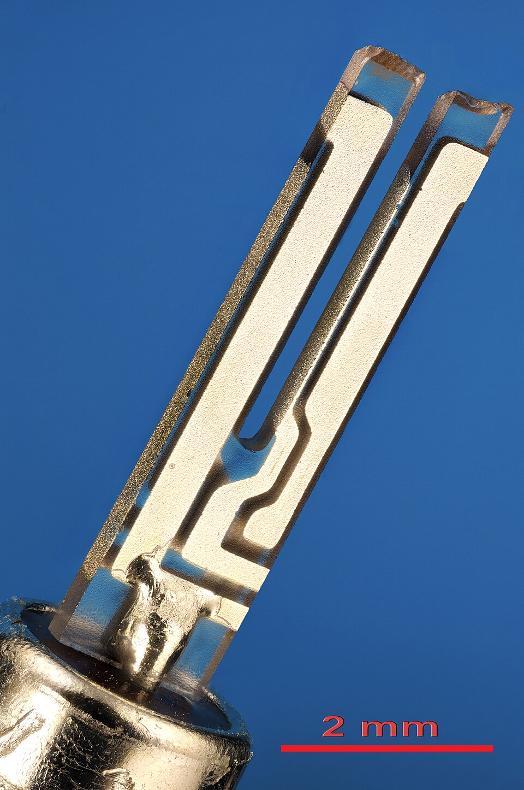
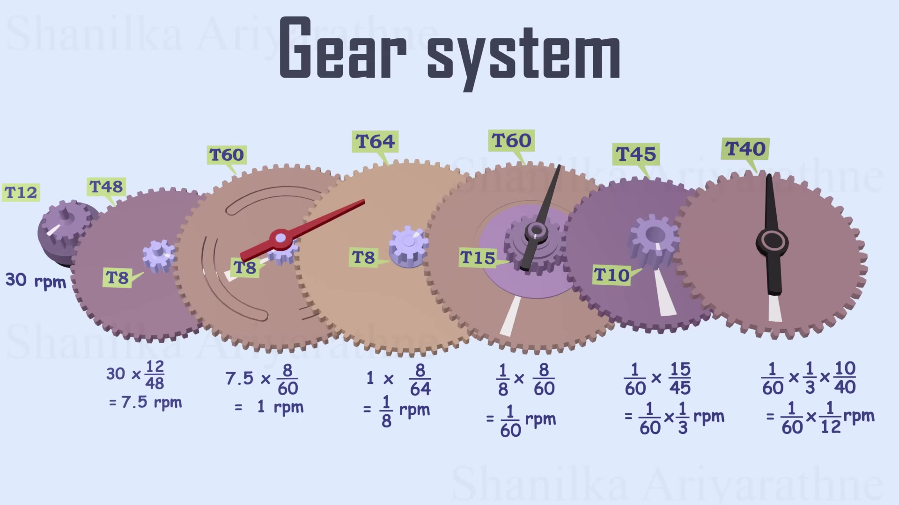
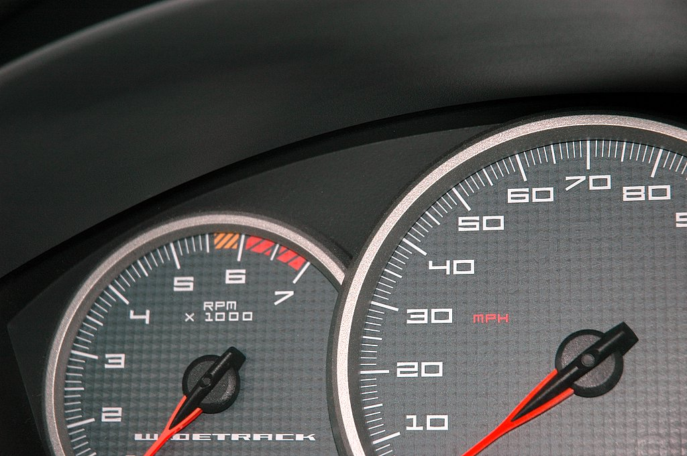
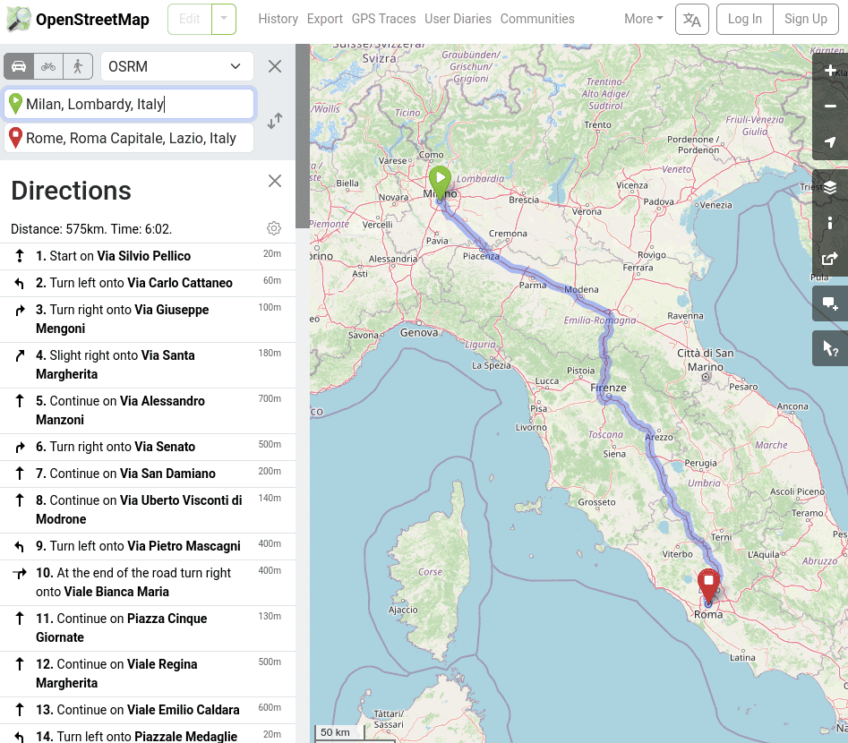

# Introduzione al corso

# L’insegnamento “Fisica e Statistica”

-   Tre moduli:
    #.   Fisica Applicata (dott. Bianchi)
    #.   Misure Elettriche ed Elettroniche (dott. Bianchi)
    #.   Statistica Medica (dott. Turati)
-   Un esame di 60 minuti per ogni modulo, nella stessa giornata
-   Obbligatoria la presenza al 70% di lezioni **per ogni modulo** (giustificazioni solo con certificato medico)

# Fisica Applicata

-   Sistemi di misura
-   Meccanica: cinematica e dinamica, l’energia
-   Oscillazioni
-   Smorzamento e filtraggio
-   Sovrapposizioni e interferenza, effetto Doppler
-   Suoni complessi e scomposizione in frequenze

# Queste slides

-   Il materiale delle lezioni di questo modulo dell’insegnamento sarà fornito in forma di slide come quelle che state vedendo ora.

-   Non c’è un libro di testo consigliato: le slide dovrebbero bastare per la preparazione.

-   Queste slides sono disponibili all'indirizzo [davide-bianchi-astro.github.io](https://davide-bianchi-astro.github.io/tecniche-audio/), e sono navigabili.

-   Se vi è più comodo, potete ottenere una versione PDF producendola da soli: basta aggiungere `?print-pdf` alla fine della URL e stampare la pagina da browser in un file PDF (vedi le [istruzioni dettagliate](https://revealjs.com/pdf-export/)).

---

{height=640px}

<https://davide-bianchi-astro.github.io/tecniche-audio/>

# Modalità d’esame

-   Questo vale solo per il modulo di Fisica Applicata (questo); gli esami di Misure Elettriche ed Elettroniche e Statistica Medica hanno le loro modalità che vi saranno illustrate dai rispettivi titolari 
-   Esame scritto della durata di 60 minuti
-   Articolato in:
    -  Alcune domande a risposta multipla
    -  Alcune domande a risposta aperta breve
    -  Analisi di un caso pratico (già visto a lezione)

# Argomenti di questa sezione

-   Cosa significa misurare?
-   Vantaggi e svantaggi dei diversi sistemi di misura
-   Come si può misurare il tempo?
-   Come convertire le unità di misura?

# Cosa significa misurare?

# Ricette

{height=600px}

::: notes
Sottolinea che la misurazione di qualcosa è un’attività della vita quotidiana, e non è limitata solo ai fisici!
:::

# Come si misura

# Due sistemi a confronto

- In Europa si usa il **Sistema Internazionale**, dove le misure sono espresse in metri, secondi, kilogrammi, etc.

- Non è l’unico sistema! Avete mai sentito parlare di piedi, pollici, once, galloni, acri…? Questo è il cosiddetto **Sistema Imperiale Britannico**, usato nel Regno Unito

- È ormai abbandonato quasi ovunque, tranne che negli USA, dov’è ancora abbastanza usato.

---

{height=640px}

# Il sistema imperiale

-   Le sue radici sono antichissime: certe convenzioni derivano dall’Impero Romano!

-   Ha suddivisioni apparentemente illogiche. Per esempio, queste sono le misure delle lunghezze:

    -   1 miglio = 8 furlong (“stadi”)
    -   1 furlong = 10 catene
    -   1 catena = 66 piedi
    -   1 piede = 30 pollici

-   Secondo voi, perché si usano divisioni così strane?

# Criteri di divisibilità

-   Nella vita quotidiana capita spesso di dover dividere una misura in più parti.

-   Ad esempio, cosa fate se dovete cucinare una cena per sei persone, ma la ricetta riporta gli ingredienti per quattro persone?

# Numeri più divisibili di altri

-   Ci sono numeri che hanno molti divisori, come il 12 (che ha 2, 3, 4 e 6 come divisori), e altri che sono messi peggio, come il 17 (un numero primo!).

-   Nella vita quotidiana è molto comodo avere a che fare con numeri facili da dividere.

-   Lo sapevano bene i Sumeri, che usavano infatti un sistema duodecimale, ossia in base 12 (basato sull’anatomia della mano umana!) anziché decimale come il nostro.

# Divisibilità dei primi 30 numeri

# Divisibilità nel sistema imperiale

-   Un miglio è lungo 5280 piedi. Il numero 5280 ha ben **quarantotto** divisori: 2, 3, 4, 5, 6, 8, 10, 11, 12, 15, 16, 20…

-   Al contrario, un numero “tondo” come 5000 ha appena **venti** divisori: 1, 2, 4, 5, 8, 10, 20…… Questo significa che quando si divide 5000 per qualcosa, è più probabile dover gestire numeri con la virgola.

-   Ecco perché gli antichi preferivano multipli diversi dal 10: nell’antichità i numeri con la virgola erano sconosciuti, e si contava solo con gli interi!

# Misure di volume

-   Lo stesso principio si vede anche nelle misure di volume:

    -   1 gallone = 4 quarti
    -   1 quarto = 2 pinte
    -   1 pinta = 2 cup (tazze)
    -   1 cup = 8 fluid ounces (fl oz)

-   Si suddivide progressivamente per 2 o multipli di 2, e ci sono tante suddivisioni: è meno necessario usare numeri con la virgola.

# Esempio pratico

-   Una ricetta per quattro persone dice di usare “1 tazza di farina” (negli USA si misura la farina in volumi anziché in grammi: è più pratico!)

-   Io però voglio preparare la ricetta per sei persone. Come faccio?

    #. Divido una tazza per quattro: siccome una tazza sono 8 fl oz, ottengo 2 fl oz a persona
    #. Moltiplico per sei: sono 12 fl oz, che equivalgono a “1 tazza e 4 fl oz”

-   Provate a pensare cos’avreste fatto se invece la dose di farina fosse stata 150 g…

# Altri esempi

-   Per misurare il peso (meglio: la massa! lo vedremo nella prossima lezione), nel Sistema Imperiale si usa la libbra, che equivale a 16 once

-   Però l’uso di dividere una libbra in 16 once è stato introdotto in Inghilterra nel 1300 per uniformarsi al sistema francese; prima una libbra era divisa in 12 once! (Questa era la divisione usata nell’Impero Romano)

-   Anche nella suddivisione di sterline in penny il Regno Unito seguiva (fino al 1971) lo stesso principio: una sterlina (“£”) valeva 20 scellini (“s”), ed uno scellino valeva 12 pence (“d”, dal latino *denarius*).

# Perché proprio queste unità?

-   Dito, piede e cubito erano usate già dagli egizi, arrivate ai romani tramite i greci

-   Quest’antichissima origine è riflessa nell’uso di alcune parole inglesi, che anziché derivare dalle lingue germaniche sono di origine latina:

    -   “Ounce” (1/12 di un pound, ossia 28,3 g) deriva da *uncia*, 1/12 di piede
    -   “Pint” (0,47 litri) deriva da *pintus*/*pictus*, perché i contenitori di liquidi usati dai romani avevano tacche dipinte
    -   “Mile” deriva da *mille passus*
    -   “Gallon” (3,78 litri) deriva da *galleta* (secchio)
    -   “Pound” (0,45 kg) deriva da *libbra pondō* (libbra di peso)

# Perché proprio queste unità?

-   Il “braccio” (*fathom*) corrisponde a 1,82 m, ossia a 2 yarde
-   Corrisponde più o meno alla distanza tra le punte dei medi delle due braccia spalancate (nell'*old english*, il termine *fœðm* significava “braccia spalancate”)
-   Era un’unità usata per misurare la profondità del mare mediante una corda attaccata a un peso

# Limiti del sistema imperiale

-   A fianco di tutti questi vantaggi (unità di misura vicine alla realtà quotidiana, comodità nella divisione, scarsa necessità di cifre decimali, lunga storia alle spalle) ci sono però degli svantaggi:

    #. Occorre ricordarsi moltissime unità di misura!
    #. Conoscere bene come fare i calcoli con le unità di lunghezza (miglia, stadi, piedi, pollici…) non aiuta molto nel fare i calcoli con i soldi (sterline, scellini…) o con i volumi (once, tazze…)

-   Per questo motivo si è inventato il Sistema Internazionale (SI) di misura, che trae ispirazioni dal Sistema Metrico Decimale inventato durante la Rivoluzione Francese.

# Il Sistema Internazionale (SI)

-   È adottato in quasi tutti i paesi del mondo (inclusa l’Italia)
-   Basato su 7 unità fondamentali (ma a noi interesseranno solo alcune di esse)
-   Ogni unità si moltiplica o divide per 10: non ci sono multipli strani come nel sistema imperiale

# Unità del SI

| Unità       | Quantità                        |
|-------------|---------------------------------|
| Metro       | Lunghezza                       |
| Chilogrammo | Massa (“peso”)                  |
| Secondo     | Tempo                           |
| Ampere      | Corrente elettrica              |
| Kelvin      | Temperatura                     |
| Mole        | Quantità di sostanza            |
| Candela     | Intensità luminosa              |
| *Conteggi*  | Numero puro (**nessuna unità**) |

# Multipli e sottomultipli

| Prefisso | Significato    | Esempio                                |
|----------|----------------|----------------------------------------|
| T (Tera) | Mille miliardi | Capacità di un disco fisso: 2 TB       |
| G (Giga) | Un miliardo    | Frequenza di rete wi-fi: 2.4 GHz       |
| M (Mega) | Un milione     | Potenza centrale idroelettrica: 226 MW |
| k (Kilo) | Mille          | Distanza Milano-Bergamo: 60 km         |
| d        | Un decimo      | Lunghezza righello: 3 dm               |
| c        | Un centesimo   | Volume di goccia da pipetta: 1 cL      |
| m        | Un millesimo   | Pastiglia di medicinale: 60 mg         |

# Vantaggi del SI

-   Tutte le unità usano gli stessi multipli e sottomultipli (“milli”, “kilo”, “giga”, etc.)
-   Dalle unità fondamentali si derivano tutte quelle derivate: una velocità in m/s è il rapporto tra una lunghezza in metri e un tempo in secondi
-   Conversioni semplici tra unità di misura: basta spostare la virgola! Ad es., 300 cm = 30 dm = 3 m = 0,3 dam. (Molto utile in medicina, dove un medico deve ad esempio adattare il dosaggio di un farmaco al peso di un paziente!)

# Svantaggi del SI

-   Tra gli svantaggi del SI, elenchiamo questi:
    1.   Il “metro” non è definito in maniera molto intuitiva: i rivoluzionari francesi stabilirono che era “la decimilionesima parte della distanza tra il Polo Nord e l’intersezione del meridiano di Parigi con l’Equatore”
    2.   Alcune unità sono molto piccole per essere comode nella vita quotidiana (il “grammo”, ed infatti l’unità fondamentale è il “kilogrammo”)

-   L’esperienza di due secoli ha mostrato che gli svantaggi sono ben inferiori ai vantaggi: oggi quasi tutto il mondo (incluso il Regno Unito!) è passato al SI.

-   Per l’esame dovrete mostrare di saper maneggiare i multipli e i sottomultipli del SI (tera, giga, mega, kilo, …)

# Il tempo

# Misurare il tempo {#time-units}

-   Abbiamo visto che il SI (sistema decimale) è molto comodo per fare calcoli, perché non usa suddivisioni strane.

-   Ma nella vita di tutti i giorni noi usiamo regolarmente un sistema di misura *non* decimale per misurare il tempo, che risale ai sumeri (4.000 anni fa!):

    -   60 secondi equivalgono a 1 minuto
    -   60 minuti equivalgono a 1 ora
    -   24 ore equivalgono a un giorno
    -   Circa 30 giorni equivalgono ad un mese
    -   12 mesi equivalgono ad un anno

# Misurare il tempo

-   Questo modo di suddividere il tempo può essere problematico nei calcoli.

-   Ad esempio, a quanti metri al secondo corrispondono 70 km/h?

-   E due ore e mezza, a quanti minuti corrispondono?

# Il sistema rivoluzionario francese

-   Abbiamo detto che il SI deriva dal sistema decimale proposto dai rivoluzionari francesi

-   Gli stessi proposero un [sistema decimale anche per il tempo](https://it.wikipedia.org/wiki/Tempo_decimale):

    - Un giorno è diviso in 10 “ore decimali” (2,4 ore)
    - Un’ora decimale è divisa in 100 “minuti decimali” (86,4 s)
    - Un minuto decimale è diviso in 100 “secondi decimali” (0,864 s)

# Il sistema rivoluzionario francese

-   Quando venne introdotto nel 1794, ne fu reso obbligatorio l’uso…
-   …ma appena un anno dopo si tolse l’obbligo, con queste motivazioni:
    - Usare gli stessi termini “ora” e “minuto” confondeva, ma introdurne di nuovi sarebbe stato complicato per la gente del popolo
    - Cambiare tutti gli orologi della nazione sarebbe costato troppo
-   È sopravvissuto in astronomia, dove oggi si usa regolarmente il [Giorno giuliano](https://it.wikipedia.org/wiki/Giorno_giuliano): questa lezione è iniziata al tempo 2.460.961,875JD (circa)

# Come si misura il tempo

-   Torniamo alla domanda iniziale: come si misura il tempo?

-   Consideriamo un problema pratico: voglio stabilire chi tra miei due amici, Luca e Serena, corre più velocemente, prendendo come riferimento una pista di atletica lunga 100 m

::: notes

Mi aspetto che tutti suggeriscano di farli partire contemporaneamente e vedere chi dei due taglia prima il traguardo

:::

# Come si misura il tempo

-   Supponiamo ora che lo stesso problema abbia una complicazione
-   Luca è presente oggi al campo d’atletica, ma Serena arriverà solo la settimana prossima
-   Luca però domani deve partire per un viaggio, e starà via a lungo, quindi è impossibile farli correre contemporaneamente

::: notes

Ora dovrebbero tutti suggerire di usare lo smartphone, un orologio da polso o un cronometro

:::

# Come si misura il tempo

-   Aggiungiamo adesso un’altra complicazione
-   In un momento in cui eravamo un po’ alticci, avevamo scommesso che non avremmo usato strumenti convenzionali come orologi o cronometri
-   Dobbiamo inventare il nostro “cronometro”: possiamo usare qualsiasi oggetto d’uso comune per stabilire un’unità di tempo con cui misurare il tempo impiegato dai due corridori
-   Ovviamente questo nostro “cronometro” deve garantire una misura ripetibile (Luca è sul campo già oggi, ma Serena arriverà solo la settimana prossima!)

::: notes

Si potrebbe immaginare di usare un metronomo, o di far oscillare un pendolo, o di bucare un secchio e misurare quanta acqua esce, o di accendere una candela e misurare quanto si è consumata, o di far rotolare un cilindro da un piano leggermente inclinato… Ci sono infinite risposte!

:::

# Metodi di misura del tempo

-   App “Orologio” del cellulare
-   Orologio da polso
-   Metronomo da musicista
-   Clessidra
-   Meridiana solare
-   …

---

{height=520px}

(Clessidra in vendita su Amazon)

---

{height=520px}

<https://en.wikipedia.org/wiki/Metronome>

---

{height=520px}

<https://en.wikipedia.org/wiki/Crystal_oscillator>

---

{height=520px}

[How Does a Clock work ? | Crystal oscillator | Flip-Flop | Lavet type motor](https://www.youtube.com/watch?v=2SF5oGDUTrI) (YouTube)

# Punti in comune

-   Abbiamo visto alcuni metodi con cui misurare il tempo:

    -   Clessidre
    -   Metronomi
    -   Oscillatori al quarzo (usati in orologi da polso e nei cellulari)

-   C’è qualcosa di comune nel loro principio di funzionamento?

# Punti in comune

-   Queste sono le cose in comune:
    1.  C’è qualcosa che si muove (sabbia, braccio del metronomo, denti del diapason)
    2.  Gli strumenti più comodi da usare hanno un movimento che si ripete, in linea di principio per sempre
-   Il movimento è fondamentale: è solo tramite esso che ci si rende conto del passare del tempo!

# La velocità

# Chi è il più veloce?

-   Torniamo al caso della corsa tra Luca e Serena, ed andiamo un po’ oltre

-   Non ci basta vedere chi dei due sia più veloce, vogliamo anche misurare **quanto**

-   Come possiamo “quantificare” la velocità?

# Distanza e tempo

-   La velocità usa un’unità di misura **derivata**, perché è una lunghezza divisa per un tempo:

    \[
    v = \frac{\Delta x}{\Delta t}.
    \]

-   L’unità più comune sono i chilometri all’ora (km/h), che vengono misurati dai tachimetri sulle automobili

-   Nel SI però, la velocità si misura in metri al secondo (m/s)

# Definizione della velocità

-   Perché dividere la distanza percorsa per il tempo?

-   Non si potrebbe invece decidere di moltiplicare tra loro distanza e tempo?

-   Oppure sommarli?

-   Oppure…

::: notes

Prendere un po’ di tempo per far ragionare gli studenti, e sentire quali sono le loro idee.

In ogni caso, è imprescindibile sottolineare che non è possibile sommare distanza e tempo, perché si possono sommare solo quantità omogenee!

:::

# Esempio

-   Se percorro 10 metri in 4 secondi (caso A), la mia velocità è
    \[
    v_A = \frac{10\,\text{m}}{4\,\text{s}} = 2{,}5\,\text{m/s}.
    \]

-   Se percorro i medesimi 10 metri in 2 secondi (caso B), la mia velocità è
    \[
    v_B = \frac{10\,\text{m}}{2\,\text{s}} = 5{,}0\,\text{m/s}.
    \]

-   Mantenendo il tempo al **denominatore**, la velocità maggiore è attribuita effettivamente al caso più veloce (B)!

# Velocità media e istantanea

-   Ci sono due tipi di velocità: **media** ed **istantanea**

-   Entrambe le velocità si misurano in metri al secondo (o km/h), ma il loro significato è diverso

---

{height=520px}

<https://en.wikipedia.org/wiki/Tachometer>

---

{height=520px}

<https://www.openstreetmap.org>

::: notes

Far calcolare agli studenti la velocità media, prima in km/h e poi in m/s: è 95,3 km/h, pari a 26,5 m/s

:::

# Calcoli con unità di misura

# Calcoli con unità di misura

-   Quando diciamo che un’auto va a 90 km/h, stiamo usando due tipi di misure: una di *spazio* e una di *tempo*.
-   La velocità misurata in km/h non usa le unità del SI, che dovrebbero essere m/s
-   Convertire unità di misura basate sul tempo è complicato, perché abbiamo visto che le sue unità sono complicate!
-   Vediamo ora alcune tecniche con cui convertire facilmente unità di misura

# Calcoli con unità di misura

-   Le unità di misura si semplificano proprio come i numeri:

    \[
    \frac{30\,\text{m}\cdot\text{kg}}{10\,\text{m}} =
    \frac{30\,\cancel{\text{m}}\cdot\text{kg}}{10\,\cancel{\text{m}}} =
    \frac{30\,\text{kg}}{10} = 3\,\text{kg}
    \]

-   Moltiplicate tra loro si combinano:

    \[
    2\,\text{m} \times 3\,\text{m} = 6\,\text{m}^2.
    \]

# Conversione di unità di misura

# Comprensione del metodo

-   A parte casi “patologici” come la temperatura (°C, °F, K), di solito per convertire un’unità di misura basta moltiplicare o dividere per qualche coefficiente

-   Sorprendentemente, molti studenti sbagliano le conversioni (persino studenti di fisica di anni avanzati!)

-   Per comprendere il senso dell’operazione, prendiamo il discorso alla larga

# La divisione

-   Il metodo che fornisco per capire come convertire tra unità di misura vuole essere molto intuitivo…

-   …ma richiede comunque di conoscere molto bene le quattro operazioni!

-   In particolare, occorre avere un’idea intuitiva del significato della divisione, che vada oltre il semplice conto meccanico.

# Usi pratici della divisione

-   Supponiamo di aver contratto con un nostro amico un debito di 12€

-   Abbiamo stabilito che restituiremo questo debito in rate settimanali di 2€ ciascuna

-   Quante rate dovremo pagare?

---

\[
\frac{12\,\text{euro}}{2\,\text{euro}} = \frac{12\,\cancel{\text{euro}}}{2\,\cancel{\text{euro}}} = 6\,\text{(numero di volte che devo pagare)}.
\]

---

Quante rate dovremmo pagare se ogni rata fosse 3€?

E quanto se ogni rata fosse 4€?

E se ogni rata fosse 6€?

---

Quante rate dovremmo pagare se una rata fosse 12€?

---

\[
\frac{12\,\text{euro}}{12\,\text{euro}} = \frac{12\,\cancel{\text{euro}}}{12\,\cancel{\text{euro}}} = 1\,\text{(numero di volte che devo pagare)}.
\]

# Euro e centesimi

-   Ovviamente 1€ = 100 centesimi

-   Di conseguenza, possiamo calcolare il numero di rate mescolando euro e centesimi:

    \[
    1 =
    \frac{12\,\text{euro}}{12\,\text{euro}} =
    \frac{1\,200\,\text{cent}}{12\,\text{euro}} =
    \frac{12\,\text{euro}}{1\,200\,\text{cent}} =
    \frac{1\,200\,\text{cent}}{1\,200\,\text{cent}}.
    \]

# Dagli euro al tempo

Quanto vale questo rapporto?

\[
\frac{60\,\text{s}}{60\,\text{s}} = ?
\]

# Dagli euro al tempo

E questo?

\[
\frac{1\,\text{min}}{60\,\text{s}} = ?
\]

# Proprietà del prodotto

-   Stiamo pazientemente avvicinandoci alla formula per la conversione di unità di misura

-   Ci serve però anche un’altra proprietà, stavolta legata al *prodotto*

-   (Avevamo infatti detto che nelle conversioni è importante sia la divisione che il prodotto!)

# Uso del prodotto

-   Si deve fare una colletta di beneficenza tra cinque (5) amici.

-   Ognuno dà 10€. Quanti soldi si sono raccolti in tutto?

# Uso del prodotto

\[
10\,\text{euro} \times 5 = 50\,\text{euro}.
\]

# Uso del prodotto

E se ci sono otto (8) amici, ciascuno dei quali dona 5€?

# Uso del prodotto

\[
5\,\text{euro} \times 8 = 40\,\text{euro}.
\]

# Uso del prodotto

Cosa succede se a donare i 5€ è una persona sola?

# Uso del prodotto

\[
5\,\text{euro} \times 1 = 5\,\text{euro}.
\]

# Riassunto

Riassumendo, abbiamo individuato queste proprietà, che ci serviranno tra un momento:

#.   Dividere una quantità per sé stessa è uguale ad 1, **anche se la quantità è espressa in unità diverse** (euro o centesimi, secondi o minuti)

#.   Moltiplicare una quantità per 1 lascia la quantità invariata

# Conversione di unità di misura

-   Il metodo più intuitivo per convertire da un’unità di misura ad un’altra è quello di moltiplicare la quantità per 1, scrivendo però questo 1 come un rapporto tra due espressioni che usano unità di misura diverse

-   Ad esempio, per convertire 660 secondi in minuti si fa così:

    \[
    \begin{aligned}
    660\,\text{s} &= 660\,\text{s} \times 1 = 660\,\text{s} \times \frac{1\,\text{min}}{60\,\text{s}} = 660\,\cancel{\text{s}} \times \frac{1\,\text{min}}{60\,\cancel{\text{s}}} = \\
    &= 660 \times \frac{1\,\text{min}}{60} =
    \frac{660}{60}\,\text{min} =
    11\,\text{min}.
    \end{aligned}
    \]

# Avvertenze

-   Occorre avere un po’ d’occhio per capire cosa mettere al numeratore e al denominatore della frazione che vale 1!

-   L’obbiettivo è quello di **semplificare** l’unità di misura che vogliamo convertire, e far apparire quella che ci interessa.

-   Se anziché moltiplicare per 1 min/60 s avessimo moltiplicato per 60 s/1 min, avremmo solo fatto un pasticcio:

    \[
    660\,\text{s} = 660\,\text{s} \times 1 = 660\,\text{s} \times \frac{60\,\text{s}}{1\,\text{min}} = 660 \times 60\,\frac{\text{s}^2}{\text{min}} = \ldots
    \]

# Caso generale

-   Abbiamo visto il “trucco” di moltiplicare per 1 nel caso in cui ci siano misure di tempo, perché queste sono complicate

-   Ma in realtà il trucco ha una validità generale, e funziona anche con altre misure

-   Potete provare ad applicarlo per convertire tonnellate (1000 kg) in grammi, o chilometri quadrati in metri quadrati

# Cosa sapere per l’esame

- Perché misuriamo
- Sistema Internazionale (SI) — Il Sistema Imperiale **non** è richiesto!
- Multipli decimali
- Vantaggi del SI
- Tempo e sue unità di misura
- Calcoli e conversioni di unità di misura

---
title: Fisica Applicata -- Parte 1
subtitle: Cosa significa misurare? 
author: Davide Bianchi ([davide.bianchi1@unimi.it](mailto:davide.bianchi1@unimi.it))
<--! date: Mercoledì 2 Settembre 2026 -->
institute: (slides mutate dal corso di Maurizio Tomasi)
...
