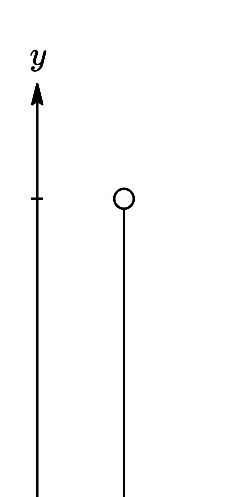
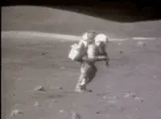
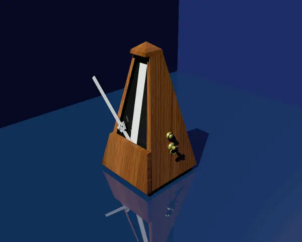
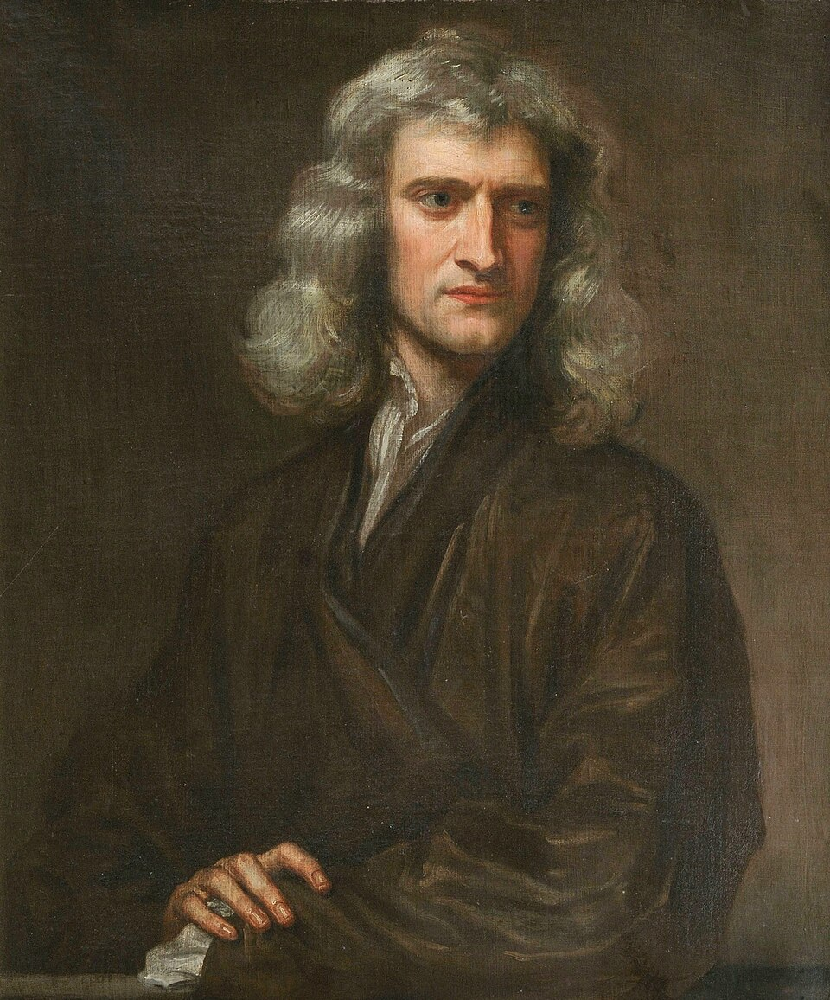
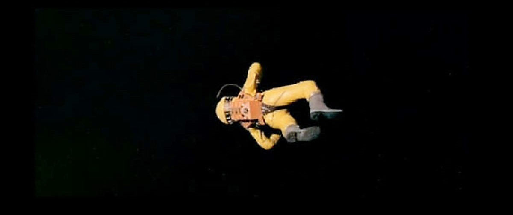
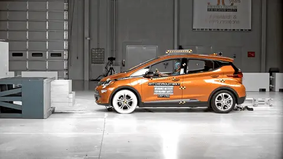
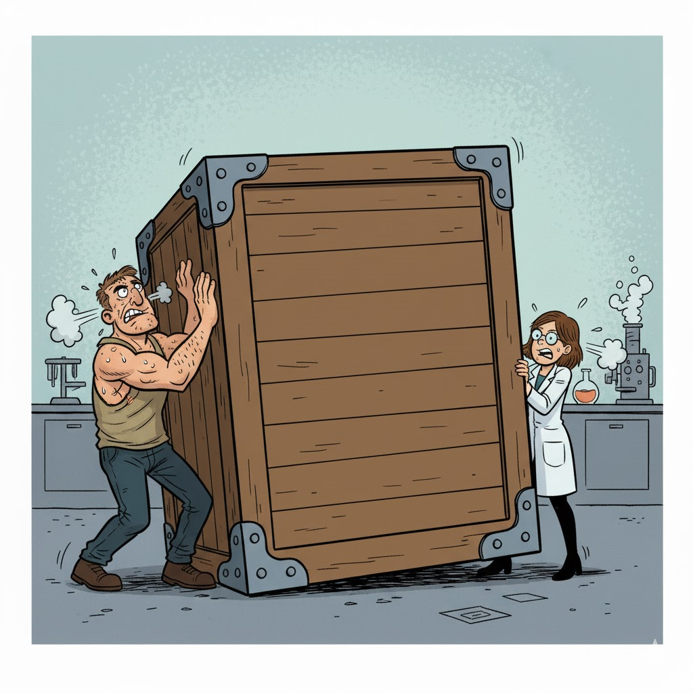
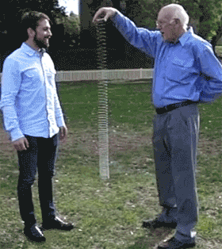
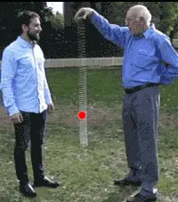
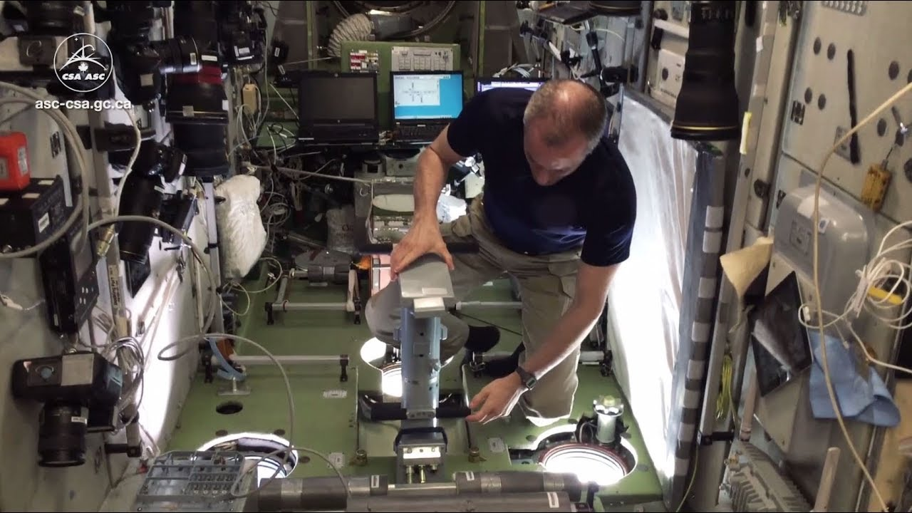

# Argomenti di questa sezione

-   Come misurare il moto dei corpi?
-   Quali sono le cause che fanno muovere i corpi?
-   Leggi di Newton
-   Periodicità in natura

# Come usare i grafici

# Come usare i grafici

-   Nel mondo scientifico, si usano molto i grafici: essi consentono di rappresentare quantità numeriche altrimenti difficili da interpretare

-   Dovreste aver già visto nella scuola secondaria come si creano e si leggono i grafici

-   Facciamo però un esempio interattivo per rispolverare alcuni concetti importanti

---

<iframe src="iframes/trajectory.html" width="100%" height="700" style="border:1px solid #ccc; border-radius: 8px;"></iframe>

::: notes

Far camminare alcuni studenti avanti ed indietro con due velocità, e commentare il grafico

:::

# Moto e forze

-  Abbiamo fatto sinora uno studio **cinematico**: la cinematica è la scienza che studia quantitativamente il moto dei corpi
-  Tre tipi di moti importanti nella cinematica sono i seguenti:

   -   Moto rettilineo uniforme: un corpo si muove in linea retta, sempre alla stessa velocità
   -   Moto rettilineo uniformemente accelerato
   -   Moto armonico

-  Sappiamo già tutto sul primo; vediamo ora brevemente gli altri due

# Moto uniformemente accelerato

::: side-by-side

::: content

-   È il tipo di moto che segue un oggetto che cade verticalmente
-   La velocità aumenta, secondo dopo secondo, di 10 m/s (ossia 36 km/h):
    #.   Se si parte da fermi, dopo 1 s si cade a 10 m/s
    #.   Dopo un altro secondo, a 20 m/s
    #.   Dopo un altro secondo, a 30 m/s…
-   Il valore 10 m/s vale **solo sulla Terra**!

:::

::: media

{height=400px}

:::
:::

# L’accelerazione

-   È la misura di quanto cambia la velocità col tempo:
    \[
    a = \frac{\Delta v}{\Delta t}
    \]

-   Nel caso della caduta di un corpo, ogni secondo ($\Delta t = 1\,\text{s}$) il corpo aumenta la sua velocità di $\Delta v = 10\,\text{m/s}$, quindi
    \[
    a = \frac{\Delta v}{\Delta t} = \frac{10\,\text{m/s}}{1\,\text{s}} = 10\,\text{m/s$^2$}.
    \]

-   Attenzione: “accelerazione” si scrive **con una elle**!

# Caduta sulla Luna

-   Come già accennato, sulla Luna l’accelerazione di gravità è appena 1,6  m/s².

-   Questo significa che i corpi impiegano più tempo che sulla Terra per cadere.

---

| Tempo | Velocità (🌍) | Velocità (🌕) | Posizione (🌍) | Posizione (🌕) |
|-------|--------------:|--------------:|---------------:|---------------:|
| 0 s   | 0 m/s         | 0 m/s         | 0 m            | 0 m            |
| 1 s   | 10 m/s        | 1,6 m/s       | 5 m            | 0,8 m          |
| 2 s   | 20 m/s        | 3,2 m/s       | 20 m           | 3,2 m          |
| 3 s   | 30 m/s        | 4,8 m/s       | 45 m           | 7,2 m          |
| 4 s   | 40 m/s        | 6,4 m/s       | 80 m           | 12,8 m         |

-   Capire la posizione non è semplice: occorre conoscere il calcolo integrale!
-   Se $g$ è l’accelerazione (10 m/s² oppure 1.6 m/s²), la formula è
    \[
    \text{Posizione} = \frac12 \times g \times t^2
    \]

# Moto armonico

-   È il tipico moto “avanti e indietro” di un metronomo, un diapason o un’altalena

-   Molto importante per l’acustica, come vedremo

{height=420px}

# Dalla cinematica alla dinamica

# Perché il moto?

-   Spostiamoci ora dalla cinematica alla **dinamica**, che studia il **motivo** per cui le cose si muovono

-   Nel corso della storia del pensiero umano, furono avanzate molte ipotesi per spiegare il moto. Alcuni esempi:

    -   [Secondo Aristotele](https://it.wikipedia.org/wiki/Fisica_aristotelica#Il_moto), le cose del mondo “sublunare” sono fatte di un miscuglio dei “quattro elementi” (terra, aria, acqua, fuoco), e tendono ad avvicinarsi a sostanze di natura simile: sassi, piume, fumo, bolle d’aria…

    -   [Secondo Buridano](https://it.wikipedia.org/wiki/Teoria_dell%27impeto) (ripreso da Oresme e Cartesio), gli oggetti si trasferiscono una sostanza, detta “impeto” (per cartesio: “quantità di moto”), che li fa muovere

# La dinamica Newtoniana

<table>
<tr>
<td style="vertical-align:middle;">
-   Nel XVIII secolo, sir Isaac Newton formulò una teoria della dinamica straordinariamente efficace
-   Lo stato naturale dei corpi è il **moto rettilineo uniforme**
-   Se un moto non è rettilineo uniforme, vuol dire che qualcosa sta agendo sul corpo: una **forza**
</td>
<td>

</tr>
</table>

# Principi di Newton

1. Lo stato naturale (“imperturbato”) dei corpi è il moto rettilineo uniforme (incluso lo stato di quiete!)
2. Un corpo sottoposto a forze si muove di moto accelerato (o decelerato), e l’accelerazione è proporzionale alla somma delle forze
3. Se un corpo A esercita una forza sul corpo B, il corpo B esercita una forza uguale e contraria sul corpo A

(Molto importante impararli tutti e tre!)

# Principi di Newton

1. Lo stato naturale (“imperturbato”) dei corpi è il moto rettilineo uniforme (incluso lo stato di quiete!)
2. Un corpo sottoposto a forze si muove di moto accelerato (o decelerato), e l’accelerazione è proporzionale alla somma delle forze
3. Se un corpo A esercita una forza sul corpo B, il corpo B esercita una forza uguale e contraria sul corpo A

(Molto importante impararli tutti e tre!)

# Primo principio

{height=420px}

[*2001: a space odyssey*](https://www.imdb.com/title/tt0062622/) (S. Kubrick, 1968)

# Secondo principio

{height=320px}

-   In quest’immagine ([*Little miss Sunshine*](https://www.imdb.com/title/tt0449059/), Dayton & Faris, 2006) il furgoncino si muove perché qualcuno lo spinge

-   La forza impressa causa un’accelerazione sul furgoncino, che partiva da fermo ma ha aumentato la sua velocità

# Terzo principio

{height=320px}

-   La macchina si ferma (= cambia la sua velocità) perché il muro esercita una forza contro di essa
-   Anche il muro si muove, perché si deforma

# Terzo principio

-   Il terzo principio di Newton è detto anche “di azione e reazione”:

    -   Se agisco con una forza su un corpo (“azione”)…

    -   …anche il corpo reagisce con una forza su di me (“reazione”)

-   È il motivo per cui quando do un pugno al muro mi faccio male!

# Discutiamo insieme

-   Perché se faccio rotolare una palla a terra, dopo un po’ si ferma?

-   Perché una piuma cade più lentamente di una palla da bowling? (Una volta data una risposta, guardate [questo video](https://www.youtube.com/watch?v=frZ9dN_ATew))

# Somma di forze

::: side-by-side

::: content

-   Il secondo principio dice che se più forze agiscono su uno stesso corpo, queste si **sommano**

-   Se quindi due forze agiscono in senso opposto e si bilanciano, l’accelerazione complessiva sarà nulla e il corpo non si sposta!

:::

::: media

:::
:::

# Statica

-   La “statica” è la parte della fisica che studia i corpi che stanno fermi

-   Per il secondo principio, i corpi che stanno fermi devono essere soggetti a forze che si annullano

-   Il caso di una mano che spinge il muro è un esempio di problema di statica

-   Un ingegnere edile deve essere esperto di statica!

# Caduta di una molla ([#1](https://www.youtube.com/shorts/k5s1cMNTmGs))

::: side-by-side

::: content

-   Lasciando penzolare una molla e facendola cadere, avviene un fenomeno interessante

-   La cima della molla cade verso terra con un’accelerazione **maggiore** di $g = 10\,\mathrm{m/s^2},$ ma il fondo della molla sembra stare sospeso a mezz’aria

-   Perché secondo voi capita questo?

:::

::: media

:::
:::

# Caduta di una molla ([#2](https://www.youtube.com/watch?v=eCMmmEEyOO0))

::: side-by-side

::: content

-   Il centro della molla cade seguendo la legge del moto rettilineo uniformemente accelerato

-   La cima della molla però ha due forze che la spingono in basso: la gravità e la forza elastica della molla

-   Anche il fondo della molla subisce le due forze (gravità ed elastica), ma sono di verso opposto e si bilanciano

:::

::: media

:::
:::

# L’inerzia

# Il concetto di “inerzia”

::: side-by-side

::: content
-   Se vi lanciassero addosso una palla e doveste fermarla con la mano, preferireste che fosse da ping-pong o da bowling?

-   Se il vostro mezzo si ferma in mezzo alla strada e dovete spingerlo fuori dalla carreggiata, è meglio che sia una Fiat 500 o un tir a pieno carico?
:::

::: media

:::
:::

# Massa inerziale

-   La “massa” (si misura in chilogrammi, kg) è una quantità intrinseca dei corpi che dice quanto è difficile metterli in moto (o fermarli)

-   Maggiore è la massa, maggiore è la forza necessaria ad accelerarli

-   In effetti, la seconda legge di Newton dice che se la forza totale è $F$, un corpo di massa $m$ subirà un’accelerazione
    \[
    a = \frac{F}{m}
    \]

# Massa inerziale

::: side-by-side

::: content
\[
a = \frac{F}{m}
\]

-   Se $F$ è grande ma $m$ è colossale, allora $a$ sarà piccola. Esempio: un rimorchiatore attaccato ad una nave merci a pieno carico.
-   Se $F$ è piccola ma $m$ è minuscola, allora $a$ sarà grande. Esempio: soffiare su dei granelli di polvere.
:::

::: media

{height=600px}

:::
:::

# Massa e peso

-   Nella vita quotidiana si tende a confondere la massa col peso.

-   Ma sono due concetti diversi: il primo è un’unità del SI, il secondo è la forza che fa cadere i corpi a terra. Quindi:

    -   La massa produce resistenza all’azione delle forze anche per un corpo nello spazio vuoto (l’astronauta di *2001: odissea nello spazio*)

    -   Il peso invece è la forza che fa accelerare verso il suolo. Esso esiste solo sulla Terra o sui pianeti, e cambia il suo valore (sulla Luna il peso è minore).

# Pesare gli astronauti?

{height=480px}

[How do astronauts weigh themselves in space?](https://www.youtube.com/watch?v=oU3pp_4n84U) (Agenzia Spaziale Canadese)

# Unità di misura

-   Se l’accelerazione si misura in m/s² e la massa in kg, allora
    \[
        \begin{split}
        a&= \frac{F}{m}\\
        m \times a&= F
        \end{split}
    \]
    e quindi la forza $F$ è il prodotto di m/s² e di kg

-   In onore di sir Isaac Newton, si definisce “Newton” la forza che accelera un corpo di 1 kg di 1 m/s²:
    \[
    1\,\text{N} = 1\,\text{kg$\cdot$m/s$^2$}
    \]

# Applicazione alla gravità

---

[Low Earth Orbit Visualization](https://platform.leolabs.space/visualizations/leo)

::: notes
Presentare il caso come se il moto fosse rettilineo uniforme, e sottolineare che i satelliti non usano carburante per tenersi in orbita (altrimenti dopo una giornata sarebbero a secco!).

Zoomare all’esterno per mostrare che in realtà il moto non è rettilineo uniforme, ma circolare!
:::

---

<iframe
    src="https://mgvez.github.io/jsorrery/"
    width="100%"
    height="640px"
    style="border:none;">
</iframe>

[jsOrrery — Javascript Solar System Simulator](https://mgvez.github.io/jsorrery/)

::: notes

Fai notare che tutti i pianeti orbitano su orbite circolari, e che l’inerzia viene bilanciata dalla gravità: se non ci fosse gravità, il moto sarebbe rettilineo verso lo spazio infinito, e se il pianeta non avesse inerzia (velocità nulla), il moto sarebbe rettilineo verso il sole.

:::

# Bilanciamento di forze

-   I pianeti viaggiano su orbite circolari anziché precipitare sul Sole perché posseggono **inerzia**, ossia la tendenza a viaggiare in linea retta
-   Tutti i corpi posseggono inerzia, che è legata alla loro massa: più ne hanno, più è difficile deviarli
-   Quando il Sistema Solare si è formato, i pianeti avevano una certa velocità iniziale: per questo non sono precipitati verso il Sole (e non precipiteranno!)

# Orbite periodiche

-   Il Sistema Solare si è formato cinque miliardi di anni fa (“cinque giga-anni”!), e i pianeti hanno (quasi) sempre orbitato nelle orbite che osserviamo oggi

-   Questa stabilità è espressione di una quantità che viene conservata: l'**energia**:

    #. Un corpo in moto possiede una certa quantità di **energia cinetica** $E_c$, che misura la sua inerzia
    #. Un pianeta “sente” l’attrazione gravitazionale del Sole, che è quantificata dall'**energia potenziale gravitazionale** $E_g$

-   I pianeti orbitano per miliardi di anni perché nessuna delle due energie prevale sull’altra

::: notes

Puoi usare come analogia i soldi: l’energia cinetica è lo stipendio che uno guadagna in un mese, mentre l’energia gravitazionale sono le spese mensili (affitto, cibo, etc.).

I pianeti stanno in equilibrio, nel senso che non spendono mai né più né meno di quanto guadagnano.

Nomina anche il fatto che la Natura preferisce la periodicità, e questo sarà importante anche nel caso delle onde sonore: se per i pianeti misuriamo la periodicità con il tempo di un’orbita (l’anno), per le onde sonore useremo la frequenza.
:::

---

<iframe src="iframes/newton-cannonball.html" width="100%" height="700" style="border:1px solid #ccc; border-radius: 8px;"></iframe>

# Conclusioni

# Cosa sapere per l’esame

-   Cinematica: velocità, velocità media e velocità istantanea
-   Dinamica di Newton; le tre leggi
-   Inerzia, differenza tra massa e peso

---
title: Fisica Applicata -- Parte 2
subtitle: Cinematica e dinamica
author: Davide Bianchi ([davide.bianchi1@unimi.it](mailto:davide.bianchi1@unimi.it))
<--! date: Mercoledì 2 Settembre 2026 -->
institute: (slides mutate dal corso di Maurizio Tomasi)
...
