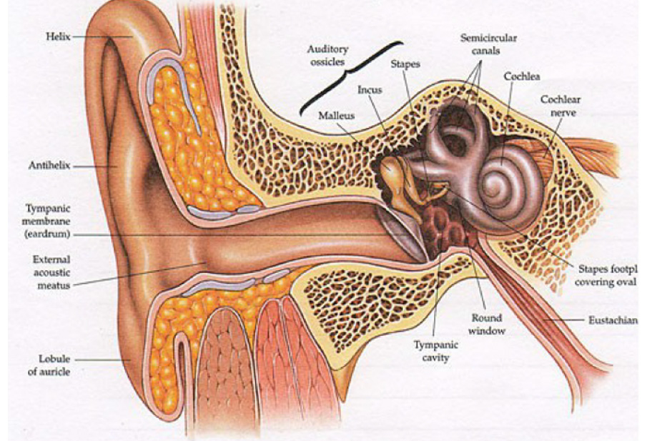
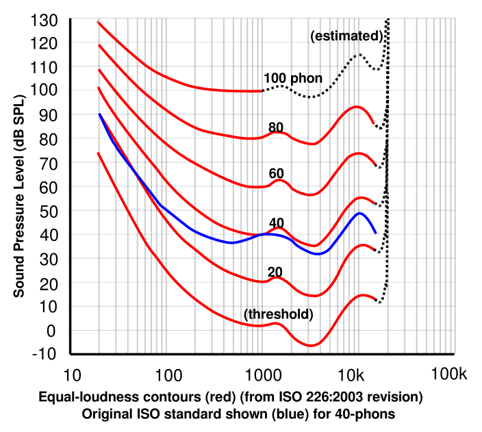
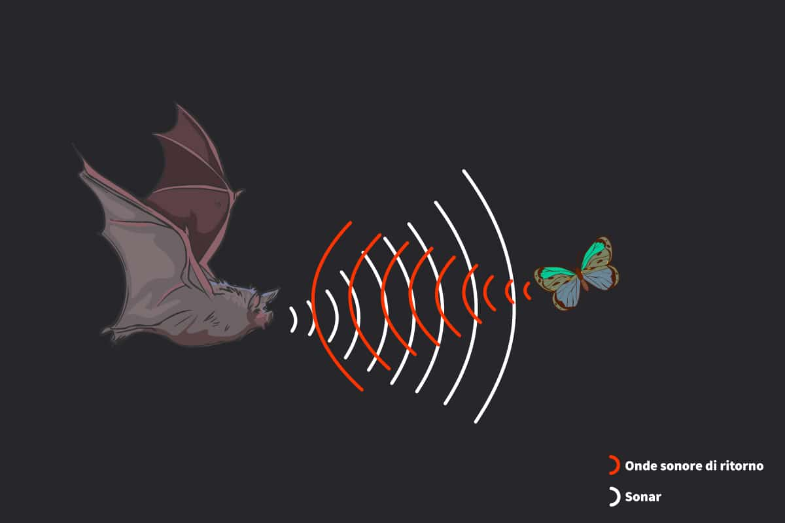
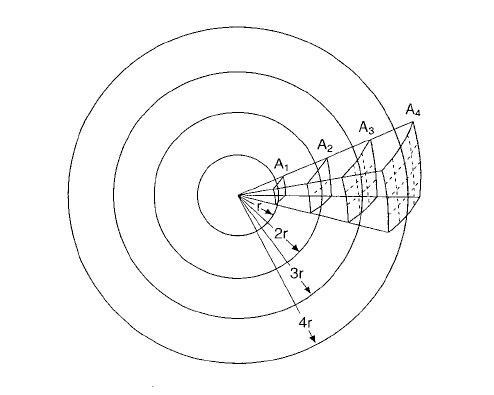
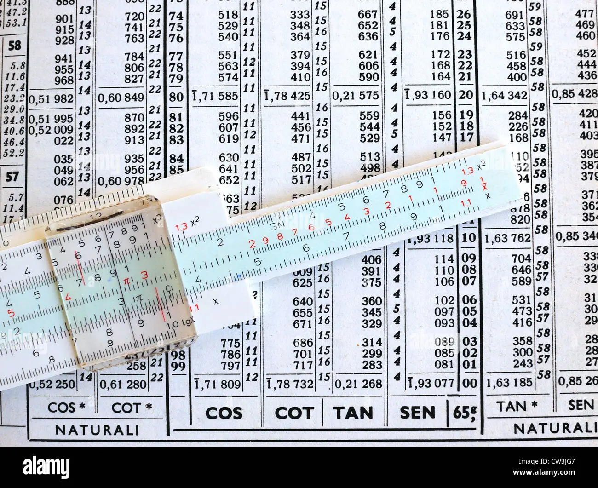
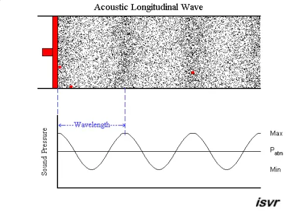
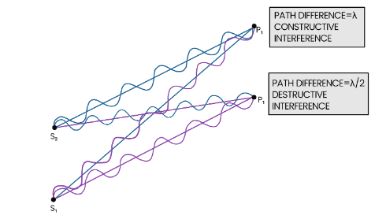
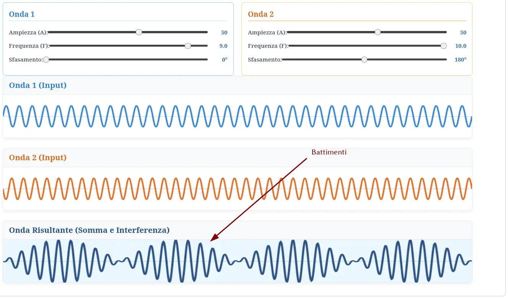

# Argomenti di questa sezione 

-   Il tipo più semplice di onda: l’onda sinusoidale

-   Proprietà delle onde sinusoidali: frequenza, sfasamento ed ampiezza

-   Concetto di “intensità del suono”

-   Come si misura l’ampiezza di un’onda? 

-   Potenze e logaritmi (per definire il “decibel”)

-   Concetti di “sovrapposizione” ed “interferenza”

# Onde sinusoidali

-   Abbiamo introdotto il concetto di “onda sinusoidale”

-   Dell’equazione

    \[
    \text{oscillazione} = A \sin (2\pi\nu t + \varphi),
    \]

    a noi interesseranno questi parametri:

    #.   La sua ampiezza (quanto la pressione varia), indicata solitamente con $A$
    #.   La sua frequenza (quanto rapidamente oscilla), indicata con $\nu$ o con $f$
    #.   La sua fase (a che istante l’onda raggiunge il suo massimo), indicata con $\varphi$

# 1. La frequenza

# Percezione della frequenza

-   Un esempio di suono (ossia, di onda periodica regolare) è la nota emessa da uno strumento, ad esempio un violino

-   L’essere umano è in grado di percepire suoni la cui frequenza sta nell’intervallo

    \[
    20\,\text{Hz} < \nu < 20\,\text{kHz},
    \]

    ma i valori cambiano con l’età: invecchiando, la frequenza udibile più elevata decresce fino a raggiungere valori intorno a 15\,\text{kHz} e anche meno.

# Perché questi limiti?

::: side-by-side

::: content

-   Per alti $\nu$, il timpano e gli ossicini collegati (martello, incudine, staffa) hanno un’inerzia che gli impedisce di oscillare rapidamente.
-   Ma anche se potessero oscillare a qualsiasi frequenza, la membrana basilare e le cellule ciliate all’interno della coclea non riuscirebbero comunque a tradurre il segnale meccanico in un impulso nervoso chiaro
-   A basse $\nu$, il nostro orecchio non ha una struttura efficiente per tradurre le vibrazioni in segnali neuronali

:::

::: media

:::
:::

# Curve isofoniche {#curve-isofoniche}

-   Il cervello umano non percepisce tutte le frequenze con la stessa sensibilità

-   Le cosiddette [curve isofoniche](https://it.wikipedia.org/wiki/Diagramma_di_uguale_intensit%C3%A0_sonora) rappresentano l’intensità percepita in funzione della frequenza e dell’intensità oggettiva (che definiremo in seguito)

-    Esse sono state ricavando facendo sentire un suono ad una frequenza di riferimento alternato ad un altro suono e aumentando o diminuendo il volume del secondo finché non fosse stato intenso quanto il primo, registrando a questo punto l’ampiezza effettiva. Si è poi ripetuto variando l’intensità del suono di riferimento

# Curve isofoniche

::: side-by-side

::: content

- Asse x: frequenza del suono in Hz.
- Asse y: Ampiezza dell’onda di pressione.
- Le varie curve indicano diverse intensità dell’onda di riferimento, dalla soglia di udibilità alla soglia del dolore.

:::

::: media

{height=620px}

:::
:::

# Ultrasuoni

::: side-by-side

::: content
-   I suoni con una frequenza superiore a 20 kHz sono detti **ultrasuoni**, e non sono udibili dall’uomo.

-   Sono però percepibili da alcuni animali:

    -   I cani, per cui esistono fischietti agli ultrasuoni
    -   I pipistrelli, che usano l’eco degli ultrasuoni per orientarsi (vedremo meglio l’eco in futuro)
:::

::: media

:::
:::

# 2. Sfasamento

# Sfasamento di un’onda

-   Dobbiamo ora parlare del termine $\varphi$ nell’equazione dell’onda sinusoidale:

    \[
    \text{oscillazione} = A \sin (2\pi\nu t + \varphi),
    \]

-   Abbiamo accennato al fatto che sia un **angolo**, e quindi si misura in gradi

-   Concettualmente esso rappresenta il momento in cui si inizia a misurare l’onda in un certo punto, e dice se ci troviamo al momento del massimo di pressione, del minimo, etc.

---

<iframe src="iframes/sinusoid-phase.html" width="100%" height="640"></iframe>

# Valori di φ

| φ    | Significato                          | %   |
|-----:|--------------------------------------|----:|
| 0°   | Pressione di equilibrio, crescente   | 0%  |
| 90°  | Massima pressione                    | 25% |
| 180° | Pressione di equilibrio, decrescente | 50% |
| 270° | Minima pressione                     | 75% |

# 3. Ampiezza

# Ampiezza di un’onda

-   Passiamo ora a discutere il senso dell’ampiezza $A$:

    \[
    \text{oscillazione} = A \sin (2\pi\nu t + \varphi),
    \]

-   Come avevamo già accennato, per un’onda acustica in un fluido come l’aria o l’acqua, l’ampiezza $A$ può essere misurata in Pascal (pressione) o in kg/m³ (densità)

-   In un mezzo solido come un muro invece l’ampiezza è uno **spostamento**, e si misura in metri (ma tipicamente lo spostamento è minore di un millesimo di mm!)

# Variazione dell’ampiezza

-   Immaginate di essere in un prato e di lanciare un urlo

-   Chi è vicino a voi sentirà il vostro grido con grande intensità

-   Ma, allontanandosi, il suono sarà sempre più debole

-   Sapete spiegare il perché?

# Ampiezza, potenza, intensità

-   Un’onda, come già sappiamo, trasmette energia

-   La “potenza” di un’onda è legata all’energia trasmessa nell’unità di tempo, e si misura in Watt

-   Però un’onda non è una particella ma qualcosa di esteso, e quindi è più appropriato parlare di una potenza $W$ distribuita su una superficie $S$. Questa è l’**intensità sonora** $I$:

    \[
    I = \frac{W}{S}
    \]

    che si misura in W/m² (Watt per metro quadro).

# Ampiezza e intensità

-   Ricordate la definizione di pressione? L’avevamo dovuta introdurre per quei casi in cui una forza $F$ non è applicata su un solo punto, ma viene “diluita” perché applicata su tanti punti (= una superficie $S$).

-   Il concetto dell'intensità è lo stesso: l'energia di un’onda si propaga investendo una superficie, e l’intensità misura la “diluzione” della potenza associata.

-   È precisamente a causa di questa diluizione che il Sole scalda la Terra di più in estate e di meno in inverno (quando è più inclinato), come mostrato nella slide successiva. (La luce è infatti un’onda elettromagnetica).

---

<iframe src="iframes/intensity.html" width="100%" height="800"></iframe>

# Ampiezza e intensità

-   L’intensità **non** è l’ampiezza, ma ad essa è strettamente legata

-   Esiste infatti una relazione, tra la pressione $P$ di un’onda e la sua intensità $I$:

    \[
    I = \frac12\frac{P^2}{\rho v_\text{suono}},
    \]

    dove $\rho$ è la densità dell’aria.

-   Non spiegheremo questa relazione; notate però che è qualitativamente simile a $E_c = \frac12 m v^2$

# Variazione dell’ampiezza

::: side-by-side

::: content

-   Il motivo per cui il suono propagandosi si attenua ha a che fare principalmente con la **conservazione dell’energia**

-   L’urlo nasce dalla vostra bocca, che ha una piccola superficie. Ma il suono si propaga ovunque nello spazio (anche verso l’alto), e l’energia sonora deve necessariamente “diluirsi” sulla superficie $4\pi r^2$ di una sfera sempre più grande.

-   Ciò avverrebbe anche **in mancanza di attrito e forze viscose**!

:::

::: media

:::
:::

# Interludio: formule

-   È bene avere presenti alcune formule geometriche legate al cerchio e alla sfera

-   Supponendo che $r$ sia il raggio (in metri) del cerchio o della sfera, valgono queste proprietà:

    #. Lunghezza della circonferenza: $2\pi r$
    #. Area del cerchio: $\pi r^2$
    #. Superficie della sfera: $4\pi r^2$
    #. Volume della sfera: $\frac43 \pi r^3$

# Trucchi mnemonici

::: side-by-side

::: content
-   Per ricordare le formule, tenete presente le unità di misura: le **lunghezze** hanno $r$, le **superfici** $r^2$, ed i **volumi** $r^3$!

-   Per distinguere l’area del cerchio ($\pi r^2$) dalla superficie della sfera ($4\pi r^2$), ricordate che la superficie di una mela (sfera) è esattamente quattro volte la superficie interna (cerchio) quando la dividete in due

:::

::: media

:::
:::

# Legge dell’inverso del quadrato {#legge-inverso-quadrato}

-   In un caso ideale, l’intensità dell’onda sonora varia come **l’inverso del quadrato** della distanza $r$. Se quindi due persone misurano un’intensità  $I_1$ e $I_2$ a due distanze $r_1$ e $r_2$, vale che

    \[
    I_1\times 4\pi r_1^2 = I_2\times 4\pi r_2^2.
    \]

-   La formula è più utile semplificando $4\pi$ e risolvendo per $I_2$:

    \[
    I_2 = I_1\times\frac{r_1^2}{r_2^2}.
    \]

# Esempio

-   Una persona è seduta in prima fila a 3 m dal professore ($r_1 = 3\,\text{m}$)
-   Un’altra persona è seduta più dietro, a 9 metri dal professore ($r_2 = 9\,\text{m}$)
-   Se l’orecchio della prima persona riceve un suono di intensità $I_1$, la seconda persona riceve un suono di ampiezza
    \[
    I_2 = I_1\times\frac{r_1^2}{r_2^2}
    = I_1\times\frac{(3\,\text{m})^2}{(9\,\text{m})^2}
    = I_1\times\frac{9}{81} = \frac{I_1}{9}
    \]

# Intensità percepita {#esempio-intensita-percepita}

-   Possiamo concludere che se la distanza triplica, l’intensità si riduce di un fattore 9, ossia 3²

-   Questo vuol dire che la seconda persona percepisce la voce del professore 9 volte meno intensa?

-   (Potete fare la prova, se volete!)

# Legge di Weber-Fechner

-   Il calcolo non è sbagliato: l’intensità diminuisce davvero di un fattore 9

-   Ma l’intensità non è ciò che misura il nostro orecchio. (Se così fosse, le aule universitarie dovrebbero essere fatte in modo che il professore stia al centro, e tutti gli studenti in cerchio attorno a lui!)

-   In prima approssimazione, le percezioni sensoriali seguono la cosiddetta “[legge di Weber-Fechner](https://it.wikipedia.org/wiki/Legge_di_Weber-Fechner)”

# Il lavoro di Weber

-   [Ernst Weber](https://it.wikipedia.org/wiki/Ernst_Heinrich_Weber) (1795-1878) scoprì che la variazione di uno stimolo viene percepita in modo differente a seconda dell’intensità iniziale dello stimolo

-   Weber verificò che se a una persona che regge un peso si aggiunge un ulteriore peso, questa lo percepirà diversamente:

    -   Aggiungere 100 g ad un carico di 10 kg dà una percezione minima, quasi inavvertibile
    -   Ma aggiungere 100 g ad un carico di 200 g è invece chiaramente avvertibile!

# La conclusione di Fechner

-   [Gustav Fechner](https://it.wikipedia.org/wiki/Gustav_Theodor_Fechner) (1801-1887) descrisse matematicamente quanto aveva osservato Weber, e derivò la formula

    \[
    p = k \log_{10} S + C
    \]

    dove $p$ è la “percezione” (ciò che avvertono i miei sensi), $S$ è lo stimolo (il fenomeno fisico che raggiunge i miei sensi), e $k$ e $C$ costanti che non ci interessano qui.

-   Anche se la legge di Weber-Fechner è un’approssimazione, è stata importante storicamente per definire il “decibel”. Dovremo quindi capire il funzionamento di $\log_{10}$, che è l’inverso di una potenza.

# Potenze

-   Per capire i decibel è sufficiente considerare solo le potenze in base 10. Quasi tutto quanto diremo però si applica anche ad altre basi

-   La potenza $n$ di 10 è definita come

    \[
    10^n = \underbrace{10 \times 10 \times \ldots \times 10}_\text{$n$ volte}
    \]

-   Esempio: $10^4 = 10 \times 10 \times 10 \times 10 = 10.000$

-   Trucco: il numero $n$ dice il numero di zeri che seguono 1.

# Prodotti di potenze

-   Quando moltiplichiamo tra loro due potenze di 10, il risultato è una potenza di 10 il cui esponente è la **somma** dei due:

    \[
    10^n \times 10^m = 10^{n + m}
    \]

-   Questo è banale da dimostrare:

    \[
    \textcolor{#08a}{10^n} \times \textcolor{#a08}{10^m} =
    \textcolor{#08a}{\underbrace{10 \times \ldots \times 10}_\text{$n$ volte}} \times
    \textcolor{#a08}{\underbrace{10 \times \ldots \times 10}_\text{$m$ volte}} = \underbrace{10 \times \ldots \times 10}_\text{$n+m$ volte}
    \]

# Rapporti tra potenze

-   Quando si dividono due potenze di dieci, il risultato è una potenza di dieci con esponente la **differenza** dei due esponenti:

    \[
    \frac{10^n}{10^m} = 10^{n - m}
    \]

-   Anche in questo caso la dimostrazione è banale:

    \[
    \frac{10^n}{10^m} = \frac{\overbrace{\cancel{10}\times\cancel{10}\times\ldots\cancel{10}}^\text{$m$ cancellazioni}\times 10\times 10\times \ldots \times 10}{\underbrace{\cancel{10}\times\cancel{10}\times\ldots\cancel{10}}_\text{$m$ volte}} = 10^{n - m}
    \]

# Altre proprietà

-   Usando un po’ di logica, si possono estendere queste operazioni anche in altri casi.

-   Ad esempio, possiamo definire le potenze **negative** tramite rapporti di potenze. Una potenza come

    \[
    10^{-4}
    \]

    può essere vista come

    \[
    10^{-4} = 10^{1 - 5} = \frac{10^1}{10^5} = \frac{10}{100.000} = 0{,}0001.
    \]

# Potenza zero-esima

-   Possiamo anche attribuire un significato alla potenza zero:

    \[
    10^0
    \]

-   Basta scrivere

    \[
    10^0 = 10^{1 - 1} = \frac{10^1}{10^1} = \frac{10}{10} = 1
    \]

-   Quindi, il 10 elevato alla zero è uguale per convenzione a 1. (Questo è coerente con il nostro trucco: “10⁰ è uguale a 1 seguito da zero zeri”!)

# Potenze frazionarie

-   Chiediamoci ora che significato dare alla potenza

    \[
    10^{0{,}5}
    \]

-   Perché la nostra definizione sia coerente con quanto detto sinora, dovremmo fare in modo che le vecchie proprietà valgano anche qui. Quindi, in particolare:

    \[
    10^{0{,}5} \times 10^{0{,}5} = 10^{0{,}5 + 0{,}5} = 10^1 = 10.
    \]

-   Ma sappiamo già qual è il numero che, moltiplicato per se stesso, è uguale a 10: si tratta della **radice quadrata** di 10, ossia $\sqrt{10} \approx 3{,}162$.

# Potenze frazionarie

-   Usando la stessa logica, è possibile dare un senso a **qualsiasi** esponente:
    \[
    \begin{aligned}
    10^{0{,}25} &= \sqrt[4]{10} \approx 1{,}778,\\
    10^{1{,}5} &= 10^1 \times 10^{0{,}5} = 10 \times \sqrt{10} = 31{,}623,\\
    \end{aligned}
    \]

    (la scrittura $\sqrt[4]{10}$ indica quel numero che elevato alla potenza 4 è uguale a 10).

-   I matematici hanno scoperto che se si definisce questa formula

    \[
    10^{\frac{n}{m}} = \sqrt[m]{10^n},
    \]

    le proprietà delle potenze continuano ad essere valide!

# Potenze frazionarie

-   Lavorando con potenze di 10 intere, abbiamo visto che il risultato è sempre 1 seguito o preceduto da zeri:

    \[
        10^4 = 10.000,\qquad 10^{-2} = 0{,}01
    \]

-   Però quando le potenze sono numeri con la virgola non è più così:

    \[
    10^{0{,}5} \approx 3{,}162,\qquad 10^{-1{,}7} \approx 0{,}01995.
    \]

-   È possibile scrivere *qualsiasi* numero come una potenza di 10?

# I logaritmi

-   La risposta è: “un po’ sì, e un po’ no”

-   Non si può infatti scrivere un numero negativo o lo zero come una potenza di dieci (a meno di non usare strumenti matematici sofisticati, che però non sono rilevanti per questo corso): **non esiste** un $k$ per cui valga $10^k = -3$!

-   Ma se un numero $n$ è positivo, i matematici hanno mostrato che è **sempre possibile** scriverlo come una potenza di dieci. L’esponente del dieci è detto “logaritmo in base dieci di $n$”, e si scrive $\log_{10} n$

    \[
    n = 10^{\log_{10} n}.
    \]

# I logaritmi

-   Riprendendo i nostri due esempi di prima

    \[
    10^{0{,}5} \approx 3{,}162,\qquad 10^{-1{,}7} \approx 0{,}01995,
    \]

    da queste stesse eguaglianze segue che

    \[
    \log_{10} 3{,}162 \approx 0{,}5,\qquad \log_{10} 0{,}01995 \approx -1{,}7
    \]

-   Ovviamente, le cose sono molto più semplici (ed esatte!) quando abbiamo potenze intere di 10:

    \[
    \log_{10} 10.000 = 4,\qquad \log_{10} 0{,}00001 = -5.
    \]

# Significato di log₁₀ ($n > 1$)

-   Se osserviamo alcuni logaritmi in base 10, possiamo notare una particolarità:

    \[
    \log_{10} 1000 = 3,\quad \log_{10} 51.523{,}4 \approx 4{,}712,\quad \log_{10}7.823.552{,}8 \approx 6{,}893
    \]

-   Se un numero maggiore di 1 ha $k$ cifre prima della virgola, il suo logaritmo è sempre tale che

    \[
    k - 1 \leq \log_{10} n < k
    \]

    In altre parole, il logaritmo in base 10 può essere anche usato per “contare” le cifre!

# Numeri minori di 1

-   Dal momento che $10^0 = 1$, vale allora che

    \[
    \log_{10} 1 = 0.
    \]

-   Per i numeri positivi che sono minori di 1, il logaritmo è negativo:

    \[
    \begin{aligned}
    10^{-2} = 0{,}01\quad&\Rightarrow\quad\log_{10} 0{,}01 = -2,\\
    10^{-1{,}7} \approx 0{,}01995\quad&\Rightarrow\quad\log_{10} 0{,}01995 = -1{,}7
    \end{aligned}
    \]

-   Se un numero è più piccolo di 1, il logaritmo dice più o meno quante cifre ci sono dopo la virgola

# Significato di log₁₀ ($n < 1$)

-   Vediamo alcuni casi pratici con $n < 1$:

    \[
    \log_{10} 0{,}001 = -3,\quad \log_{10} 0{,}054 \approx -1{,}268,\quad \log_{10}0{,}00000852 \approx -5{,}07
    \]

-   Se un numero minore di 1 ha $k$ zeri dopo la virgola, il suo logaritmo è sempre negativo e tale che

    \[
    -k - 1 \leq \log_{10} n < -k
    \]

    Anche qui il logaritmo “conta”, ma nella direzione opposta, e stavolta conta gli zeri!

# Approssimazioni

-   Se volete stimare un logaritmo, è possibile arrotondare i numeri: il logaritmo “perdona” facilmente gli arrotondamenti.

-   L’abbiamo visto proprio negli esempi delle slide precedenti:

    \[
    \begin{aligned}
    10^{-1{,}7} \approx 0{,}01995\quad&\Rightarrow\quad\log_{10} 0{,}01995 = -1{,}7,\\
    10^{-2} = 0{,}01\quad&\Rightarrow\quad\log_{10} 0{,}01 = -2
    \end{aligned}
    \]

    Arrotondando 0.01995 a 0.1 (**grande** arrotondamento! abbiamo dimezzato il numero!), il risultato −1,7 diventa 2.

# Esercizi

Provate a stimare (ad occhio!) il valore del logaritmo di 10 di questi numeri

\[
\begin{aligned}
\log_{10} 16.341\qquad &\log_{10} 65.316.732.001\\
\log_{10} 5\qquad &\log_{10} 1\\
\log_{10} 0{,}1\qquad &\log_{10} 0{,}01\\
\log_{10} 0{,}3\qquad &\log_{10} 0{,}089\\
\log_{10} 10{,}35\qquad &\log_{10} 163{,}1\\
\end{aligned}
\]

# Proprietà dei logaritmi

-   Dalle proprietà delle potenze discendono le proprietà dei logaritmi:

    \[
    \log_{10} \bigl(10^n \times 10^m\bigr) = \log_{10} 10^{n + m} = n + m = \log_{10} 10^n + \log_{10} 10^m.
    \]

-   Lo stesso vale per il logaritmo di una divisione, solo che al posto della somma $n + m$ compare la differenza $n - m$

-   Quindi, **i logaritmi trasformano i prodotti in somme, e le divisioni in differenze**

# Esempi

-   Supponiamo di voler calcolare un prodotto molto complicato:

    \[
    3.562.512 \times 7.412.559.919
    \]

-   Se passiamo ai logaritmi in base dieci, abbiamo che

    \[
    \log_{10} 3.562.512 \approx 6{,}?,\qquad
    \log_{10} 7.412.559.919 \approx 9{,}?
    \]

-   Quindi il logaritmo in base 10 del risultato sarà $6{,}? + 9{,}?$, ossia qualcosa tra 15 e 16: il risultato è quindi un numero a 16–17 cifre. Infatti

    \[
    3.562.512 \times 7.412.559.919 = 26.407.333.662.156.528
    \]

# Calcoli veloci

-   Prima che inventassero le calcolatrici, per calcolare prodotti tra grandi numeri si usavano i logaritmi

-   Si mandavano a memoria i logaritmi in base 10 dei numeri da 1 a 9, e poi si scrivevano i numeri in modo “furbo” per calcolarne più rapidamente i logaritmi. Ad esempio:

    \[
    \begin{aligned}
    \log_{10} 351.912 &\approx \log_{10} 350.000 = \log_{10} 3{,}5\times 10^5 = \log_{10} 3{,}5 + \log_{10} 10^5 =\\
    &= \log_{10} 3{,}5 + 5 = 0{,}54 + 5 = 5{,}54
    \end{aligned}
    \]

-   Una volta calcolati i logaritmi, si sommavano tra loro per ottenere il logaritmo in base 10 del risultato. Con trucchi e regoli calcolatori, dal logaritmo si risaliva al risultato.

---

{height=560px}

<small>
Vedi anche l’articolo [How slide rules work](https://amenzwa.github.io/stem/ComputingHistory/HowSlideRulesWork/).
</small>

# Proprietà delle potenze

-   La settimana scorsa avevamo visto queste due proprietà delle potenze:

    \[
    10^n \times 10^m = 10^{n + m},\qquad \frac{10^n}{10^m} = 10^{n - m},
    \]

    che valgono anche se $n$ e $m$ sono numeri negativi o con la virgola

-   Abbiamo anche visto che è sempre possibile scrivere un numero positivo $n$ come potenza di 10, se si usa come esponente il numero

    \[
    \log_{10} n
    \]

# Legge di Weber-Fechner

-   Siamo finalmente pronti per tornare alla legge di Weber-Fechner:

    \[
    p = k \log_{10} S + C
    \]

    dove $p$ è la “percezione” che avvertono i miei sensi ed $S$ misura ciò che stimola i miei sensi, ossia nel caso del suono la sua intensità $I$

-   La legge suggerisce che anche in presenza di numeri molto grandi per $S$, il valore di $P$ non cresce molto: questo proprio per le proprietà del logaritmo che abbiamo visto!

# Esempio di Weber

-   L’esempio della legge di Weber che abbiamo visto è:

    -   Aggiungere 100 g ad un carico di 10 kg dà una percezione minima, quasi inavvertibile
    -   Ma aggiungere 100 g ad un carico di 200 g è invece chiaramente avvertibile!

-   Vediamo come questo si traduce nella formula di Weber-Fechner

# Primo caso

-   A un carico di 10 kg sommo 100 g. I due stimoli sono

    \[
    \begin{aligned}
    S_1 &= 10\,\text{kg},\\
    S_2 &= 10\,\text{kg} + 0{,}1\,\text{kg} = 10{,}1\,\text{kg}.
    \end{aligned}
    \]

-   Le mie due percezioni, supponendo che $k = 1$ e $C = 0$, sono
    \[
    \begin{aligned}
    p_1 &= \log_{10} 10 = 1,\\
    p_2 &= \log_{10} 10{,}1 \approx 1{,}004.
    \end{aligned}
    \]

    Le due percezioni differiscono dello 0,4%.

# Secondo caso

-   Adesso devo invece sommare 100 g a un carico di 100 g. Gli stimoli sono

    \[
    \begin{aligned}
    S_1 &= 0{,}1\,\text{kg},\\
    S_2 &= 0{,}1\,\text{kg} + 0{,}1\,\text{kg} = 0{,}2\,\text{kg}.
    \end{aligned}
    \]

-   Le percezioni sono
    \[
    \begin{aligned}
    p_1 &= \log_{10} 0{,}1 = -1,\\
    p_2 &= \log_{10} 0{,}2 \approx -0{,}70.
    \end{aligned}
    \]

-   In questo caso, le percezioni differiscono del 30%!

# I decibel

-   Per misurare gli stimoli, si usa il “decibel”, indicato con “dB”. Questa è un’unità **logaritmica**: per convertire dalle unità del SI non si deve moltiplicare o dividere per un fattore, ma **applicare un logaritmo in base 10**

-   Nel caso di un’onda sonora, se la sua intensità espressa in W/m² è $I$, il suo valore $L$ in decibel è

    \[
    L = 10\log_{10} \frac{I}{I_0},
    \]

    dove $I_0$ è un valore di riferimento. (Per le onde sonore, di solito si usa la soglia dell’udibilità, ossia la minima intensità percepibile).

# I decibel

-   Per confrontare $I$ con il riferimento $I_0$ si usa il rapporto
    \[
    \frac{I}{I_0}.
    \]

-   È un po’ come quando si calcola uno sconto percentuale sul prezzo di un acquisto: anche lì si deve calcolare un rapporto (sconto/prezzo×100).

-   Se ci pensate, uno sconto è infatti più significativo quando si rapporta al prezzo totale di quando si esprime in euro. Per l’intensità $I$ è lo stesso!

# I decibel

-   Il motivo per cui i decibel richiedono di applicare un logaritmo è che in questo modo l’unità di misura dà immediatamente una misura della **sensazione**, nell’ipotesi in cui sia valida la legge di Weber-Fechner

-   In altre parole, un suono di 30 dB risulta doppiamente intenso rispetto allo stesso suono con intensità di 15 dB.

-   (Ricordate invece che misurando l’intensità in W/m² eravamo arrivati a strane conclusioni, vero?)

# Soglia di udibilità

-   Nella definizione di decibel compare il rapporto tra $I$ ed un’intensità di riferimento:

    \[
    L = 10\log_{10} \frac{I}{I_0},
    \]

    dove $I_0$ è l’intensità associata alla soglia di udibilità (il più debole rumore che si possa percepire).

-   La soglia di udibilità è convenzionalmente fissata a

    \[
    I_0 = 10^{-12}\,\mathrm{W/m^2},
    \]

    anche se il valore effettivo varia da persona a persona, e anche dalla frequenza del suono (vedi le slide sulle [curve isofoniche](tomasi-lezione-07.html#curve-isofoniche)).

# Significato di $I_0$

-   L’uso di $I_0$ nella formula dei decibel serve a “normalizzare” la misura: il valore in decibel della soglia di udibilità è

    \[
    L_0 = 10\log_{10}\frac{I_0}{I_0} = 10\log_{10}1 = 0\,\text{dB}.
    \]

-   Siccome qualsiasi altro suono avrà un’intensità maggiore di $I_0$, ciò vuol dire che l’intensità in decibel sarà **sempre positiva**

# Soglia del dolore

-   All’opposto della soglia di udibilità c’è la soglia del dolore, che è anch’esso un valore convenzionale, fissato a

    \[
    I_\text{pain} = 1\,\mathrm{W/m^2}.
    \]

-   Il valore in decibel corrispondente è

    \[
    \begin{aligned}
    L_\text{pain} &= 10\log_{10}\frac{I_\text{pain}}{I_0} = 10\log_{10}\frac{1\,\mathrm{W/m^2}}{10^{-12}\,\mathrm{W/m^2}} = 10\log_{10}10^{12} =\\
    &= 120\,\text{dB}.
    \end{aligned}
    \]

# Il fattore 10

-   L’unità di misura non si chiama “bel” ma “*deci*bel” perché davanti al logaritmo compare il fattore 10

-   Questo significa che i decibel non “misurano il numero di cifre” come un semplice logaritmo! Se un’intensità è 1000 volte maggiore della soglia di udibilità $I_0$, allora

    \[
    L = 10\log_{10}\frac{1000 I_0}{I_0} = 10\log_{10} 1000 = 10 \times 3 = 30\,\text{dB}.
    \]

-   30 dB indicano un’intensità in W/m² che è 1000 volte maggiore, 40 dB un’intensità 10.000 volte maggiore, 50 dB 100.000 volte maggiore, etc.

# Variabilità dei decibel

-   I valori della soglia dell’udibilità ($10^{-12}\,\mathrm{W/m^2}$) e del dolore ($1\,\mathrm{W/m^2}$) dovrebbero farvi apprezzare i decibel

-   Se infatti non esistessero i decibel, potreste imbattervi in misure di intensità dove un numero misurato potrebbe essere ad esempio

    \[
    0{,}000\,000\,000\,165\,12\,\mathrm{W/m^2}.
    \]

-   Ma il numero, espresso in decibel, è (fate la prova con una calcolatrice)

    \[
    22{,}2\,\text{dB}
    \]

    Le intensità in decibel non superano mai il centinaio o poco più

# Numeri da ricordare

In questa slide elenco una serie di numeri da ricordare

| Impulso sonoro                  | Intensità |
|---------------------------------|----------:|
| Soglia dell’udibilità           |      0 dB |
| Sussurro                        |     30 dB |
| Voce normale                    |     60 dB |
| Cabina di aereo durante il volo |     80 dB |
| Soglia del dolore               |    120 dB |

# Stessi numeri ma in W/m²

Per farvi apprezzare i decibel, vi mostro gli stessi numeri espressi con le unità SI. Chiaramente questi numeri **non** sono da imparare!

| Impulso sonoro                  |              Intensità |
|---------------------------------|-----------------------:|
| Soglia dell’udibilità           | 0,000 000 000 001 W/m² |
| Sussurro                        |     0,000 000 001 W/m² |
| Voce normale                    |         0,000 001 W/m² |
| Cabina di aereo durante il volo |           0,000 1 W/m² |
| Soglia del dolore               |                 1 W/m² |

# Numeri da ricordare

Questi numeri invece sono relativi a **differenze** tra due intensità $L_1$ e $L_2$ espresse in dB, e sono ugualmente da ricordare:

| Differenza $L_1 - L_2$ in dB | Rapporto tra intensità $I_1/I_2$ (W/m²) |
|-----------------------------:|----------------------------------------:|
|                         3 dB |                                      ×2 |
|                        10 dB |                                     ×10 |
|                        20 dB |                                    ×100 |
|                        30 dB |                                   ×1000 |

# Legge dell’inverso del quadrato

# Inverso del quadrato

-   Ricordate la legge dell’inverso del quadrato? Essa dice che ad una distanza $r_2$, il suono ha un’intensità rispetto a $r_1$ uguale a

    \[
    I_2 = I_1\times\frac{r_1^2}{r_2^2}.
    \]

-   La formula vale se si usano le unità del SI per le intensità e le distanze, ma riscritta in decibel diventa più semplice:

    \[
    L_2 = 10\log_{10}\frac{I_2}{I_0} = 10\log_{10}\left(\frac{I_1}{I_0}\times\frac{r_1^2}{r_2^2}\right).
    \]

# Inverso del quadrato

-   La quantità

    \[
    10\log_{10}\left(\frac{I_1}{I_0}\times\frac{r_1^2}{r_2^2}\right)
    \]

    può essere semplificata usando le proprietà dei logaritmi:

    \[
    10\log_{10}\left(\frac{I_1}{I_0}\times\frac{r_1^2}{r_2^2}\right) =
    10\log_{10}\frac{I_1}{I_0} + 10\log_{10}\frac{r_1^2}{r_2^2} =
    L_1 + 10\log_{10}\frac{r_1^2}{r_2^2}
    \]

-   Notiamo che è comparso il valore in decibel $L_1$ dell’intensità $I_1$

# Inverso del quadrato

-   La divisione di due quadrati è il quadrato della divisione, e il logaritmo di un quadrato si semplifica:

    \[
    \begin{aligned}
    \log_{10}\frac{r_1^2}{r_2^2} &= \log_{10}\left(\frac{r_1}{r_2}\right)^2 =
    \log_{10}\left[\left(\frac{r_1}{r_2}\right)\times\left(\frac{r_1}{r_2}\right)\right] =\\
    &= \log_{10}\frac{r_1}{r_2} + \log_{10}\frac{r_1}{r_2} =
    2\log_{10}\frac{r_1}{r_2}
    \end{aligned}
    \]

-   Tra l’altro, abbiamo dimostrato che $\log_{10} n^2 = 2\times \log_{10} n$: il logaritmo trasforma le potenze in prodotti! (Anche frazionarie…)

# Inverso del quadrato

-   Abbiamo dunque ottenuto il risultato

    \[
    L_2 = L_1 + 20\log_{10}\frac{r_1}{r_2}
    \]

-   Questo è notevolmente più semplice della formula espressa nel SI:
    \[
    I_2 = I_1\times\frac{r_1^2}{r_2^2}.
    \]

    perché ha trasformato il prodotto di quantità con molte cifre in una somma di due quantità piccole, e ha fatto sparire il calcolo di due quadrati.

# Esempio

-   Ricordate l’esempio del professore che parla in classe? Avevamo visto che triplicando la distanza, l’intensità si riduceva di un fattore 9

-   Vediamo ora che se $L_1$ è l’intensità in decibel che raggiunge chi è seduto più vicino, allora chi è seduto a una distanza tre volte maggiore percepisce un’intensità pari a

    \[
    L_2 = L_1 + 20\log_{10}\frac{r_1}{r_2} = L_1 + 20\log_{10}\frac13 = L_1 + (-9{,}5\,\text{dB})
    \]

-   Triplicando la distanza, si “perdono” circa 10 dB di intensità.

# Numeri da ricordare

-   Abbiamo visto che se si aumenta la distanza di un fattore 3, l’intensità diminuisce di quasi 10 dB (i W/m² sono 9 volte minori)

-   Se la distanza **raddoppia**, l’intensità diminuisce di **6 dB**

-   Se la distanza **decuplica**, l’intensità diminuisce di **20 dB** (i W/m² sono 100 volte minori)

-   Se la distanza **centuplica**, l’intensità diminuisce di **40 dB** (i W/m² sono 10.000 volte minori)

-   I tre numeri in grassetto sono da imparare a memoria: come prima, vi suggerisco di creare delle flash cards.

# Sovrapposizione e interferenza

# Sovrapposizione e interferenza

-   Abbiamo sempre parlato sinora di **una** onda sonora che si propaga. Ma nella realtà siamo sempre circondati da molti suoni!

-   Quando due onde si incontrano in un punto dello spazio, vale il principio di **sovrapposizione**: se alle onde non è associata “troppa energia”, i loro effetti si sommano

-   Questo è il **principio di sovrapposizione**, e non vale solo per le onde sonore!

---

<video controls width="1080">
  <source src="media/veritasium-double-slit-experiment.mp4" type="video/mp4" />
  Your browser does not support the video tag.
</video>

<small>[The original double slit experiment](https://www.youtube.com/watch?v=Iuv6hY6zsd0)</small>

# Interferenza

-   La sovrapposizione è un **principio**: dice che due onde che si incontrano nel medesimo punto producono un’onda risultante data dalla somma delle due

-   L’**interferenza** è il risultato della sovrapposizione di più onde. Esso dà origine a fenomeni molto interessanti, perché a volte l’interferenza causa un *rinforzo* delle onde, ma altre volte può annullare il loro effetto!

-   Per fare un’analogia: suono tre tasti del pianoforte e sento un accordo consonante o dissonante. Il fatto che ci arrivi il suono insieme è dato dalla sovrapposizione, la consonanza/dissonanza dall’interferenza.

# Tipi di interferenza

-   Ci sono vari modi in cui si manifesta l’interferenza tra due onde:

    -   Se i massimi ed i minimi di pressione avvengono sempre contemporaneamente (“onde in fase”), si ha **interferenza costruttiva**: il suono è rinforzato

    -   Se invece i massimi di pressione dell’una avvengono in coincidenza con i minimi dell’altra e viceversa, l’effetto è una **interferenza distruttiva**, in cui il suono è attenuato

    -   Se le due onde non hanno la stessa $\nu$, l’interferenza è alternatamente costruttiva e distruttiva, e si hanno i **battimenti**: l’intensità “pulsa”

-   Tutti questi effetti si possono vedere nell’applicazione della slide successiva

---

<iframe src="iframes/interference.html" width="100%" height="760"></iframe>

# Interferenza distruttiva

::: side-by-side

::: content

-   Le cuffie a cancellazione del rumore hanno un microfono che riceve il suono ambientale e lo riproduce indirizzandolo all’orecchio, ma con uno sfasamento di mezza lunghezza d’onda
-   Nell’orecchio entra quindi il suono ambientale, più ciò che produce la cuffia, ossia la musica e il suono ambientale “sfasato”:
    \[
    \begin{aligned}
    \text{Risultato} &= \cancel{\textcolor{#269342}{\text{Ambiente}}} + \textcolor{#932642}{\text{Musica}} - \cancel{\textcolor{#932642}{\text{Ambiente}}} = \\
    &= \textcolor{#932642}{\text{Musica}}
    \end{aligned}
    \]

:::

::: media

{width=320px}

:::
:::

# Lunghezza d’onda {#wavelength}

::: side-by-side

::: content

-   La **lunghezza d’onda**, che si indica con la lettera λ (“lambda”), rappresenta la distanza fisica tra un picco di pressione e il successivo (la “semilunghezza” è la metà della lunghezza d’onda)

-   Essendo una distanza, λ si misura in metri

-   Si può trovare λ dalla relazione (intuitiva: provate a pensarci!)

    \[
    v_\text{suono} = \lambda \times \nu \quad\Rightarrow\quad \lambda = \frac{v_\text{suono}}{\nu}.
    \]

:::

::: media

:::
:::

# Esempi

-   Un suono basso a 20 Hz ha una lunghezza d’onda uguale a
    \[
    \lambda = \frac{343\,\text{m/s}}{20\,\text{s}^{-1}} \approx 17\,\text{m}
    \]

-   Il suono di un diapason a 440 Hz ha una lunghezza d’onda uguale a
    \[
    \lambda = \frac{343\,\text{m/s}}{440\,\text{s}^{-1}} \approx 78\,\text{cm}
    \]

# Interferenza e λ

::: side-by-side

::: content

-   Se riproduco il medesimo suono da due altoparlanti che sono a una distanza diversa dal mio orecchio, si avrà interferenza

-   Se la distanza del più lontano è maggiore di un numero intero di lunghezze d’onda λ (2λ, 3λ, 4λ, 5λ…), l’interferenza sarà costruttiva

-   Ma se è invece maggiore di un numero dispari di semi-lunghezze d’onda λ (λ/2, 3λ/2, 5λ/2, 7λ/2…), l’interferenza sarà distruttiva

:::

::: media

:::
:::

# Battimenti

{height=600px}

# Battimenti

-   I battimenti sono un tipo di interferenza in cui le due onde non hanno la stessa frequenza; l’interferenza continua quindi ad alternarsi tra costruttiva e distruttiva

-   L’effetto è quello di un’onda la cui intensità cambia da un minimo ad un massimo, con una frequenza data da

    \[
    \nu_\text{battimento} = \left|\nu_1 - \nu_2\right|.
    \]

-   Sono molto utili per accordare tra loro strumenti: se si sentono battimenti quando suonano la stessa nota, non sono accordati!

# Eco e riverbero

# L’eco

-   Un’onda che raggiunge un corpo rigido come un muro può venire riflessa, tornando indietro

-   L’eco è il suono riflesso che torna all’orecchio dell’ascoltatore, con un ritardo sufficiente per essere percepito come un suono separato

-   È come vedere la propria immagine riflessa in uno specchio: il suono è un’onda proprio come la luce, ed entrambe vengono riflesse dalle superfici

# Il riverbero

-   Il riverbero è un fenomeno simile all’eco, ma è causato da molteplici riflessioni che raggiungono l’orecchio rapidamente, sovrapponendosi e fondendosi col suono originale

-   È il fenomeno che fa percepire il suono dell’organo in una cattedrale come ricco e “prolungato”, grazie a innumerevoli riflessioni che si sommano.

---

<iframe width="840" height="472" src="https://www.youtube.com/embed/erXG9vnN-GI?si=Whg0iHD1I22ZhYCO" title="YouTube video player" frameborder="0" allow="accelerometer; autoplay; clipboard-write; encrypted-media; gyroscope; picture-in-picture; web-share" referrerpolicy="strict-origin-when-cross-origin" allowfullscreen></iframe>

Toccata e fuga in re minore BWV 565 di J. S. Bach, suonata da Liene Andreta Kalnciema nella cattedrale di Riga (Lituania).

---

La [cattedrale di Riga](https://en.wikipedia.org/wiki/Riga_Cathedral) occupa circa 8000 m², e l’organo è uno dei più grandi d’Europa, con un’altezza di 25 metri e 6768 canne.

# Conclusioni

# Cosa sapere per l’esame

-   Onde sinusoidali
-   Significato della fase
-   Ampiezza e intensità sonora
-   Potenze e logaritmi in base 10
-   Legge di Weber-Fechner
-   Definizione di decibel
-   Legge dell’inverso del quadrato espressa in decibel (senza dimostrazione)
-   Sovrapposizione e interferenza, lunghezza d’onda, battimenti

---
title: Fisica Applicata -- Parte 6
subtitle: Onde sinusoidali, decibel, sovrapposizione e interferenza
author: Davide Bianchi ([davide.bianchi1@unimi.it](mailto:davide.bianchi1@unimi.it))
<--! date: Mercoledì 2 Settembre 2026 -->
institute: (slides mutate dal corso di Maurizio Tomasi)
...
